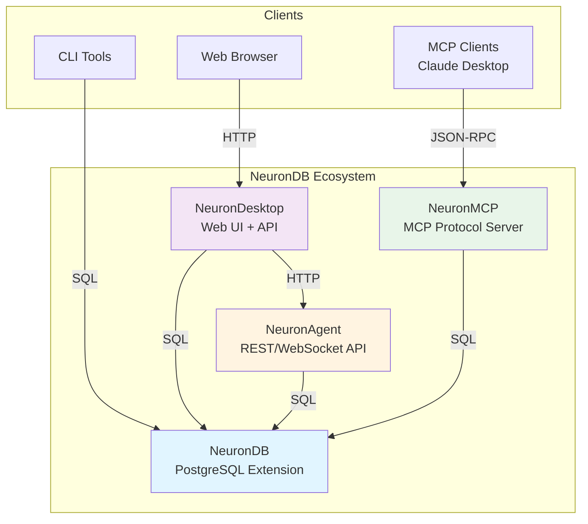

# NeuronDB Documentation Index

**Complete documentation reference for the NeuronDB AI Database Ecosystem**

## How to Use This Documentation

This documentation is organized to support different reading modes:

- **Getting started**: Get running quickly and understand the basics
- **Internals**: Deeper architecture, internals, performance, and deployment patterns
- **Reference**: Concise lookups (glossary, doc maps, summaries)

### Recommended Learning Path

**Follow this path for the best learning experience:**

- [ ] **Step 1:** Start with **[QUICKSTART.md](QUICKSTART.md)** - Get all services running in minutes
- [ ] **Step 2:** Read **[Docs/getting-started/simple-start.md](Docs/getting-started/simple-start.md)** - Simple setup guide
- [ ] **Step 3:** Review **[Docs/getting-started/architecture.md](Docs/getting-started/architecture.md)** - Understand the architecture
- [ ] **Step 4:** Keep **[Docs/getting-started/troubleshooting.md](Docs/getting-started/troubleshooting.md)** handy for issues
- [ ] **Step 5:** Use **[Docs/reference/readme.md](Docs/reference/readme.md)** for quick lookups

### Documentation Entry Points

- **Getting started**: [Docs/getting-started/readme.md](Docs/getting-started/readme.md)
- **Components**: [Docs/components/readme.md](Docs/components/readme.md)
- **Deployment**: [Docs/deployment/readme.md](Docs/deployment/readme.md)
- **Reference**: [Docs/reference/readme.md](Docs/reference/readme.md)

### Docker

- **Canonical compose file**: Repository root [`docker-compose.yml`](docker-compose.yml)
- **Docker management docs**: [dockers/readme.md](dockers/readme.md)

---

## Official Documentation

**For comprehensive, up-to-date documentation, visit:**

**[https://www.neurondb.ai/docs](https://www.neurondb.ai/docs)**

<strong>What's available on the official site</strong>

- Complete API references (all 473 SQL functions)
- Detailed tutorials and step-by-step guides
- Best practices and production guides
- Performance optimization strategies
- Latest updates and release notes

---

## Quick Start

| Document | Description | Time to Complete |
|----------|-------------|------------------|
| **[QUICKSTART.md](QUICKSTART.md)** | Get all services running in minutes | 5-10 minutes |
| **[README.md](README.md)** | Project overview and architecture | 15 minutes |
| **[COMPATIBILITY.md](COMPATIBILITY.md)** | Version and platform compatibility | 5 minutes |

---

## Architecture & Components

### System Architecture

<strong>Architecture Diagram</strong>

### Component Documentation

| Component | Quick Links | Description |
|-----------|-------------|-------------|
| **NeuronDB** | [README](NeuronDB/README.md) · [INSTALL](NeuronDB/INSTALL.md) · [Docs](NeuronDB/docs/) | PostgreSQL extension with vector search, 52+ ML algorithms, GPU acceleration |
| **NeuronAgent** | [README](NeuronAgent/README.md) · [API](NeuronAgent/docs/API.md) · [Architecture](NeuronAgent/docs/ARCHITECTURE.md) | REST/WebSocket agent runtime with autonomous agents |
| **NeuronMCP** | [README](NeuronMCP/README.md) · [Tools](NeuronMCP/TOOLS_REFERENCE.md) · [Setup](NeuronMCP/docs/NEURONDB_MCP_SETUP.md) | MCP protocol server with 100+ tools |
| **NeuronDesktop** | [README](NeuronDesktop/README.md) · [API](NeuronDesktop/docs/API.md) · [Deployment](NeuronDesktop/docs/DEPLOYMENT.md) | Unified web interface dashboard |

### Ecosystem Documentation

| Document | Description |
|----------|-------------|
| [Ecosystem Overview](Docs/ecosystem/readme.md) | How components work together |
| [Integration Guide](Docs/ecosystem/integration.md) | Component integration patterns |
| [Docker Guide](dockers/readme.md) | Docker deployment for all services |

---

## Installation & Setup

### Installation Guides

| Guide | Platform | Use Case |
|-------|----------|----------|
| [NeuronDB Installation](NeuronDB/INSTALL.md) | All platforms | Install PostgreSQL extension |
| [Docker Installation](dockers/readme.md) | Docker | Container deployment |
| [Quick Start](QUICKSTART.md) | Docker | Get everything running fast |

### Setup Scripts

| Script | Purpose |
|--------|---------|
| `scripts/setup_neurondb_ecosystem.sh` | Unified setup for all components |
| `scripts/verify_neurondb_integration.sh` | Comprehensive integration testing |
| `scripts/smoke-test.sh` | Quick smoke tests |

---

## Feature Documentation

### Vector Search & Indexing

| Feature | Documentation |
|---------|---------------|
| **Vector Types** | [NeuronDB/docs/vector-search/vector-types.md](NeuronDB/docs/vector-search/vector-types.md) |
| **Indexing** | [NeuronDB/docs/vector-search/indexing.md](NeuronDB/docs/vector-search/indexing.md) |
| **Distance Metrics** | [NeuronDB/docs/vector-search/distance-metrics.md](NeuronDB/docs/vector-search/distance-metrics.md) |
| **Quantization** | [NeuronDB/docs/vector-search/quantization.md](NeuronDB/docs/vector-search/quantization.md) |

### Machine Learning

| Algorithm Category | Documentation |
|-------------------|---------------|
| **Random Forest** | [NeuronDB/docs/ml-algorithms/random-forest.md](NeuronDB/docs/ml-algorithms/random-forest.md) |
| **Gradient Boosting** | [NeuronDB/docs/ml-algorithms/gradient-boosting.md](NeuronDB/docs/ml-algorithms/gradient-boosting.md) |
| **Clustering** | [NeuronDB/docs/ml-algorithms/clustering.md](NeuronDB/docs/ml-algorithms/clustering.md) |
| **Classification** | [NeuronDB/docs/ml-algorithms/classification.md](NeuronDB/docs/ml-algorithms/classification.md) |
| **Regression** | [NeuronDB/docs/ml-algorithms/regression.md](NeuronDB/docs/ml-algorithms/regression.md) |
| **Dimensionality Reduction** | [NeuronDB/docs/ml-algorithms/dimensionality-reduction.md](NeuronDB/docs/ml-algorithms/dimensionality-reduction.md) |
| **Outlier Detection** | [NeuronDB/docs/ml-algorithms/outlier-detection.md](NeuronDB/docs/ml-algorithms/outlier-detection.md) |
| **Quality Metrics** | [NeuronDB/docs/ml-algorithms/quality-metrics.md](NeuronDB/docs/ml-algorithms/quality-metrics.md) |
| **Drift Detection** | [NeuronDB/docs/ml-algorithms/drift-detection.md](NeuronDB/docs/ml-algorithms/drift-detection.md) |
| **Topic Discovery** | [NeuronDB/docs/ml-algorithms/topic-discovery.md](NeuronDB/docs/ml-algorithms/topic-discovery.md) |
| **Time Series** | [NeuronDB/docs/ml-algorithms/time-series.md](NeuronDB/docs/ml-algorithms/time-series.md) |
| **Recommendation Systems** | [NeuronDB/docs/ml-algorithms/recommendation-systems.md](NeuronDB/docs/ml-algorithms/recommendation-systems.md) |

### ML & Embeddings

| Feature | Documentation |
|---------|---------------|
| **Embedding Generation** | [NeuronDB/docs/ml-embeddings/embedding-generation.md](NeuronDB/docs/ml-embeddings/embedding-generation.md) |
| **Model Inference** | [NeuronDB/docs/ml-embeddings/model-inference.md](NeuronDB/docs/ml-embeddings/model-inference.md) |
| **Model Management** | [NeuronDB/docs/ml-embeddings/model-management.md](NeuronDB/docs/ml-embeddings/model-management.md) |
| **AutoML** | [NeuronDB/docs/ml-embeddings/automl.md](NeuronDB/docs/ml-embeddings/automl.md) |
| **Feature Store** | [NeuronDB/docs/ml-embeddings/feature-store.md](NeuronDB/docs/ml-embeddings/feature-store.md) |

### Hybrid Search & Retrieval

| Feature | Documentation |
|---------|---------------|
| **Hybrid Search** | [NeuronDB/docs/hybrid-search/overview.md](NeuronDB/docs/hybrid-search/overview.md) |
| **Multi-Vector** | [NeuronDB/docs/hybrid-search/multi-vector.md](NeuronDB/docs/hybrid-search/multi-vector.md) |
| **Faceted Search** | [NeuronDB/docs/hybrid-search/faceted-search.md](NeuronDB/docs/hybrid-search/faceted-search.md) |
| **Temporal Search** | [NeuronDB/docs/hybrid-search/temporal-search.md](NeuronDB/docs/hybrid-search/temporal-search.md) |

### Reranking

| Method | Documentation |
|--------|---------------|
| **Cross-Encoder** | [NeuronDB/docs/reranking/cross-encoder.md](NeuronDB/docs/reranking/cross-encoder.md) |
| **LLM Reranking** | [NeuronDB/docs/reranking/llm-reranking.md](NeuronDB/docs/reranking/llm-reranking.md) |
| **ColBERT** | [NeuronDB/docs/reranking/colbert.md](NeuronDB/docs/reranking/colbert.md) |
| **Ensemble** | [NeuronDB/docs/reranking/ensemble.md](NeuronDB/docs/reranking/ensemble.md) |

### RAG Pipeline

| Feature | Documentation |
|---------|---------------|
| **RAG Overview** | [NeuronDB/docs/rag/overview.md](NeuronDB/docs/rag/overview.md) |
| **LLM Integration** | [NeuronDB/docs/rag/llm-integration.md](NeuronDB/docs/rag/llm-integration.md) |
| **Document Processing** | [NeuronDB/docs/rag/document-processing.md](NeuronDB/docs/rag/document-processing.md) |

### Background Workers

| Worker | Documentation |
|--------|---------------|
| **neuranq** | [NeuronDB/docs/background-workers/neuranq.md](NeuronDB/docs/background-workers/neuranq.md) |
| **neuranmon** | [NeuronDB/docs/background-workers/neuranmon.md](NeuronDB/docs/background-workers/neuranmon.md) |
| **neurandefrag** | [NeuronDB/docs/background-workers/neurandefrag.md](NeuronDB/docs/background-workers/neurandefrag.md) |
| **neuranllm** | [NeuronDB/docs/background-workers/neuranllm.md](NeuronDB/docs/background-workers/neuranllm.md) |

### GPU Acceleration

| Platform | Documentation |
|----------|---------------|
| **CUDA Support** | [NeuronDB/docs/gpu/cuda-support.md](NeuronDB/docs/gpu/cuda-support.md) |
| **ROCm Support** | [NeuronDB/docs/gpu/rocm-support.md](NeuronDB/docs/gpu/rocm-support.md) |
| **Metal Support** | [NeuronDB/docs/gpu/metal-support.md](NeuronDB/docs/gpu/metal-support.md) |
| **Auto-Detection** | [NeuronDB/docs/gpu/auto-detection.md](NeuronDB/docs/gpu/auto-detection.md) |

---

## 🔧 Configuration & Operations

### Configuration

| Document | Description |
|----------|-------------|
| [NeuronDB Configuration](NeuronDB/docs/configuration.md) | Extension configuration options |
| [NeuronAgent Config](NeuronAgent/config.yaml) | Agent runtime configuration |
| [NeuronMCP Config](NeuronMCP/mcp-config.json.example) | MCP server configuration |

### Operations & Monitoring

| Document | Description |
|----------|-------------|
| [Performance Monitoring](NeuronDB/docs/performance/monitoring.md) | Metrics and monitoring |
| [SIMD Optimization](NeuronDB/docs/performance/simd-optimization.md) | Performance optimization |
| [Security Overview](NeuronDB/docs/security/overview.md) | Security features |
| [Troubleshooting](NeuronDB/docs/troubleshooting.md) | Common issues and solutions |

---

## 🔌 API References

### NeuronDB SQL API

| Document | Description |
|----------|-------------|
| [SQL API Reference](NeuronDB/docs/sql-api.md) | Complete SQL function reference (473 functions) |
| [Function Stability](NeuronDB/docs/function-stability.md) | API stability classifications |
| [Deprecation Policy](NeuronDB/docs/deprecation-policy.md) | Deprecation and removal process |
| [API Snapshots](NeuronDB/docs/api-snapshots/readme.md) | Versioned API references |

### NeuronAgent API

| Document | Description |
|----------|-------------|
| [REST API Reference](NeuronAgent/docs/API.md) | Complete REST API documentation |
| [OpenAPI Spec](NeuronAgent/openapi/openapi.yaml) | OpenAPI 3.0 specification |
| [Architecture](NeuronAgent/docs/ARCHITECTURE.md) | System architecture |

### NeuronMCP API

| Document | Description |
|----------|-------------|
| [Tools Reference](NeuronMCP/TOOLS_REFERENCE.md) | Complete tool reference (100+ tools) |
| [PostgreSQL Tools](NeuronMCP/POSTGRESQL_TOOLS.md) | PostgreSQL administration tools (27 tools) |
| [Tool Catalog](NeuronMCP/docs/tool-resource-catalog.md) | Complete tool and resource catalog |
| [Setup Guide](NeuronMCP/docs/NEURONDB_MCP_SETUP.md) | MCP server setup |

### NeuronDesktop API

| Document | Description |
|----------|-------------|
| [API Reference](NeuronDesktop/docs/API.md) | Complete API documentation |
| [Integration Guide](NeuronDesktop/docs/INTEGRATION.md) | Component integration |
| [NeuronAgent Usage](NeuronDesktop/docs/NEURONAGENT_USAGE.md) | Using NeuronAgent in UI |
| [NeuronMCP Setup](NeuronDesktop/docs/NEURONMCP_SETUP.md) | MCP server setup in UI |

---

## 🚢 Deployment

### Docker Deployment

| Document | Description |
|----------|-------------|
| [Docker Overview](dockers/readme.md) | Docker deployment guide |
| [NeuronDB Docker](NeuronDB/docker/readme.md) | Database container deployment |
| [NeuronAgent Docker](NeuronAgent/docker/readme.md) | Agent runtime deployment |
| [NeuronMCP Docker](NeuronMCP/docker/readme.md) | MCP server deployment |

### Production Deployment

| Document | Description |
|----------|-------------|
| [NeuronAgent Deployment](NeuronAgent/docs/DEPLOYMENT.md) | Production deployment guide |
| [NeuronDesktop Deployment](NeuronDesktop/docs/DEPLOYMENT.md) | Web interface deployment |
| [Security Policy](SECURITY.md) | Security best practices |

---

## 📝 Examples & Tutorials

### Use Case Examples

| Example | Description |
|---------|-------------|
| [Semantic Search](examples/semantic-search-docs/) | Document semantic search |
| [RAG Chatbot](examples/rag-chatbot-pdfs/) | RAG with PDFs |
| [Agent Tools](examples/agent-tools/) | Building agent tools |
| [MCP Integration](examples/mcp-integration/) | MCP client integration |

### Code Examples

| Component | Examples Location |
|-----------|------------------|
| **NeuronDB** | [NeuronDB/demo/](NeuronDB/demo/) (60+ SQL examples) |
| **NeuronAgent** | [NeuronAgent/examples/](NeuronAgent/examples/) (38 files) |
| **NeuronMCP** | [NeuronMCP/docs/examples/](NeuronMCP/docs/examples/) |

---

## Contributing

| Document | Description |
|----------|-------------|
| [Contributing Guide](CONTRIBUTING.md) | How to contribute |
| [Code of Conduct](CODE_OF_CONDUCT.md) | Community guidelines |
| [Security Policy](SECURITY.md) | Vulnerability reporting |

---

## Reference

### Version Information

| Document | Description |
|----------|-------------|
| [Compatibility Matrix](COMPATIBILITY.md) | Platform and version compatibility |
| [What's New](NeuronDB/docs/whats-new.md) | Latest features and changes |
| [Technology Roadmap](NeuronDB/docs/TECHNOLOGY_ROADMAP.md) | Future plans |

### Testing

| Document | Description |
|----------|-------------|
| [Testing Guide](NeuronAgent/TESTING.md) | Testing strategy |
| [Docker Test Results](dockers/TEST_RESULTS.md) | Docker test results |

---

## Support

### Getting Help

| Resource | Description |
|----------|-------------|
| **Official Documentation** | [https://www.neurondb.ai/docs](https://www.neurondb.ai/docs) |
| **GitHub Issues** | [Report Issues](https://github.com/neurondb/NeurondB/issues) |
| **GitHub Discussions** | [Ask Questions](https://github.com/neurondb/NeurondB/discussions) |
| **Email Support** | support@neurondb.ai |
| **Security Issues** | security@neurondb.ai |

---

## Quick Navigation by Task

**Find what you need quickly:**

<strong>Get Started</strong>

- [ ] Install everything quickly → [QUICKSTART.md](QUICKSTART.md)
- [ ] Understand the architecture → [README.md](README.md)
- [ ] Check compatibility → [COMPATIBILITY.md](COMPATIBILITY.md)

<strong>Work with Vectors</strong>

- [ ] Store and search vectors → [Vector Types](NeuronDB/docs/vector-search/vector-types.md)
- [ ] Create indexes → [Indexing](NeuronDB/docs/vector-search/indexing.md)
- [ ] Optimize search → [Distance Metrics](NeuronDB/docs/vector-search/distance-metrics.md)

<strong>Use Machine Learning</strong>

- [ ] Train models → [ML Algorithms](NeuronDB/docs/ml-algorithms/)
- [ ] Generate embeddings → [Embedding Generation](NeuronDB/docs/ml-embeddings/embedding-generation.md)
- [ ] Deploy models → [Model Management](NeuronDB/docs/ml-embeddings/model-management.md)

<strong>Build AI Agents</strong>

- [ ] Create agents → [NeuronAgent README](NeuronAgent/README.md)
- [ ] Use REST API → [API Reference](NeuronAgent/docs/API.md)
- [ ] Deploy agents → [Deployment Guide](NeuronAgent/docs/DEPLOYMENT.md)

<strong>Integrate with MCP</strong>

- [ ] Setup MCP server → [NeuronMCP README](NeuronMCP/README.md)
- [ ] Use with Claude → [Setup Guide](NeuronMCP/docs/NEURONDB_MCP_SETUP.md)
- [ ] Explore tools → [Tools Reference](NeuronMCP/TOOLS_REFERENCE.md)

<strong>Use Web Interface</strong>

- [ ] Setup dashboard → [NeuronDesktop README](NeuronDesktop/README.md)
- [ ] Integrate components → [Integration Guide](NeuronDesktop/docs/INTEGRATION.md)
- [ ] Deploy production → [Deployment Guide](NeuronDesktop/docs/DEPLOYMENT.md)

<strong>Deploy with Docker</strong>

- [ ] Quick start → [QUICKSTART.md](QUICKSTART.md)
- [ ] Docker guide → [Docker README](dockers/README.md)
- [ ] Component-specific → Each component's `docker/` directory

<strong>Develop & Contribute</strong>

- [ ] Contributing → [CONTRIBUTING.md](CONTRIBUTING.md)
- [ ] Testing → [Testing Guide](NeuronAgent/TESTING.md)
- [ ] Security → [SECURITY.md](SECURITY.md)

---

## Statistics

**Project Scale & Capabilities:**

<strong>Project Statistics</strong>

| Category | Count | Details |
|----------|-------|---------|
| **SQL Functions** | 473 | NeuronDB extension functions |
| **ML Algorithms** | 52+ | Classification, regression, clustering, etc. |
| **MCP Tools** | 100+ | Model Context Protocol tools |
| **Components** | 4 | NeuronDB, NeuronAgent, NeuronMCP, NeuronDesktop |
| **PostgreSQL Versions** | 3 | 16, 17, 18 |
| **GPU Platforms** | 4 | CPU, CUDA, ROCm, Metal |

<strong>Documentation Statistics</strong>

| Category | Count | Location |
|----------|-------|-----------|
| **Documentation Files** | 60+ | NeuronDB/docs/ |
| **Code Examples** | 38 | NeuronAgent/examples/ |
| **Deployment Guides** | 5 | Across components |
| **API References** | 4 | SQL, REST, MCP, Web UI |

---

**Last Updated:** 2025-12-31  
**Documentation Version:** 1.0.0

