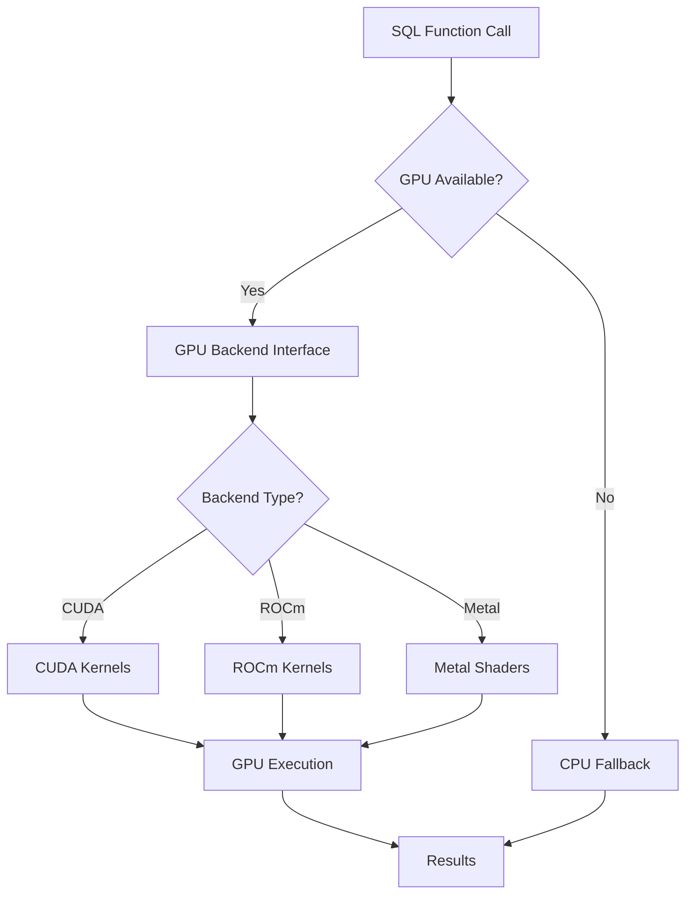

# GPU Acceleration Complete Reference

**Complete documentation for GPU acceleration in NeuronDB (CUDA, ROCm, Metal).**

> **Version:** 1.0  
> **Last Updated:** 2025-01-01

## Table of Contents

- [Overview](#overview)
- [GPU Backend Interface](#gpu-backend-interface)
- [CUDA Implementation](#cuda-implementation)
- [ROCm Implementation](#rocm-implementation)
- [Metal Implementation](#metal-implementation)
- [Memory Management](#memory-management)
- [Kernel Implementations](#kernel-implementations)
- [Performance Tuning](#performance-tuning)

---

## Overview

NeuronDB supports GPU acceleration for vector operations and ML algorithms through three backends:

1. **CUDA** (NVIDIA GPUs)
2. **ROCm** (AMD GPUs)
3. **Metal** (Apple Silicon)

### Architecture



---

## GPU Backend Interface

### Backend Structure

```c
typedef struct ndb_gpu_backend {
    /* Identity */
    const char *name;
    const char *provider;
    NDBGpuBackendKind kind;
    unsigned int features;
    int priority;

    /* Lifecycle */
    int (*init)(void);
    void (*shutdown)(void);
    int (*is_available)(void);

    /* Device management */
    int (*device_count)(void);
    int (*device_info)(int device_id, NDBGpuDeviceInfo *info);
    int (*set_device)(int device_id);

    /* Memory management */
    int (*mem_alloc)(void **ptr, size_t bytes);
    int (*mem_free)(void *ptr);
    int (*memcpy_h2d)(void *dst, const void *src, size_t bytes);
    int (*memcpy_d2h)(void *dst, const void *src, size_t bytes);

    /* Kernel launchers */
    int (*launch_l2_distance)(...);
    int (*launch_cosine)(...);
    int (*launch_kmeans_assign)(...);
    /* ... more kernels ... */

    /* ML algorithm support */
    int (*rf_train)(...);
    int (*rf_predict)(...);
    int (*lr_train)(...);
    int (*lr_predict)(...);
    /* ... more algorithms ... */
} ndb_gpu_backend;
```

### Backend Registration

Backends are registered at module load time:

```c
void neurondb_gpu_init(void) {
    // Register CUDA backend
    #ifdef NDB_GPU_CUDA
    register_cuda_backend();
    #endif

    // Register ROCm backend
    #ifdef NDB_GPU_ROCM
    register_rocm_backend();
    #endif

    // Register Metal backend
    #ifdef NDB_GPU_METAL
    register_metal_backend();
    #endif
}
```

---

## CUDA Implementation

### Overview

CUDA backend provides NVIDIA GPU acceleration using CUDA C/C++.

### Files

**Core:**
- `gpu/common/gpu_core.c`: Backend initialization
- `gpu/common/gpu_backend_registry.c`: Backend registry
- `gpu/cuda/gpu_backend_cuda.c`: CUDA backend implementation

**Kernels:**
- `gpu/cuda/gpu_kernels.cu`: Distance kernels (L2, cosine, inner product)
- `gpu/cuda/gpu_kmeans_kernels.cu`: K-Means kernels
- `gpu/cuda/gpu_knn_kernels.cu`: KNN kernels
- `gpu/cuda/gpu_rf_kernels.cu`: Random Forest kernels
- `gpu/cuda/gpu_lr_kernels.cu`: Logistic Regression kernels
- `gpu/cuda/gpu_linreg_kernels.cu`: Linear Regression kernels
- `gpu/cuda/gpu_svm_kernels.cu`: SVM kernels
- `gpu/cuda/gpu_dt_kernels.cu`: Decision Tree kernels
- `gpu/cuda/gpu_gmm_kernels.cu`: GMM kernels
- `gpu/cuda/gpu_hf_kernels.cu`: Hugging Face model kernels
- `gpu/cuda/gpu_flash_attention.cu`: Flash Attention implementation

**ML Algorithms:**
- `gpu/cuda/gpu_rf_cuda.c`: Random Forest GPU training
- `gpu/cuda/gpu_lr_cuda.c`: Logistic Regression GPU training
- `gpu/cuda/gpu_linreg_cuda.c`: Linear Regression GPU training
- `gpu/cuda/gpu_svm_cuda.c`: SVM GPU training
- `gpu/cuda/gpu_dt_cuda.c`: Decision Tree GPU training
- `gpu/cuda/gpu_gmm_cuda.c`: GMM GPU training
- `gpu/cuda/gpu_knn_cuda.c`: KNN GPU operations
- `gpu/cuda/gpu_catboost_cuda.c`: CatBoost GPU support
- `gpu/cuda/gpu_xgboost_cuda.c`: XGBoost GPU support

### CUDA Kernels

#### L2 Distance Kernel

```cuda
__global__ void l2_distance_kernel(
    const float *A,
    const float *B,
    float *out,
    int n,
    int d
) {
    int idx = blockIdx.x * blockDim.x + threadIdx.x;
    if (idx >= n) return;

    float sum = 0.0f;
    for (int i = 0; i < d; i++) {
        float diff = A[idx * d + i] - B[i];
        sum += diff * diff;
    }
    out[idx] = sqrtf(sum);
}
```

#### Cosine Distance Kernel

```cuda
__global__ void cosine_distance_kernel(
    const float *A,
    const float *B,
    float *out,
    int n,
    int d
) {
    int idx = blockIdx.x * blockDim.x + threadIdx.x;
    if (idx >= n) return;

    float dot = 0.0f;
    float norm_a = 0.0f;
    float norm_b = 0.0f;

    for (int i = 0; i < d; i++) {
        float a_val = A[idx * d + i];
        float b_val = B[i];
        dot += a_val * b_val;
        norm_a += a_val * a_val;
        norm_b += b_val * b_val;
    }

    out[idx] = 1.0f - (dot / (sqrtf(norm_a) * sqrtf(norm_b)));
}
```

### Memory Management

**CUDA Memory Pool:**
- Configurable pool size via `neurondb.gpu_memory_pool_mb`
- Automatic allocation and deallocation
- Memory reuse for performance

**Example:**
```c
// Allocate GPU memory
void *gpu_ptr;
backend->mem_alloc(&gpu_ptr, size);

// Copy host to device
backend->memcpy_h2d(gpu_ptr, host_ptr, size);

// Execute kernel
backend->launch_l2_distance(...);

// Copy device to host
backend->memcpy_d2h(host_ptr, gpu_ptr, size);

// Free GPU memory
backend->mem_free(gpu_ptr);
```

### Stream Management

CUDA supports multiple streams for parallel execution:

```c
// Create streams
cudaStream_t streams[2];
for (int i = 0; i < 2; i++) {
    cudaStreamCreate(&streams[i]);
}

// Launch kernels on different streams
launch_kernel_1<<<grid, block, 0, streams[0]>>>(...);
launch_kernel_2<<<grid, block, 0, streams[1]>>>(...);

// Synchronize
cudaDeviceSynchronize();
```

**Configuration:**
```sql
SET neurondb.gpu_streams = 4;  -- Number of streams
```

---

## ROCm Implementation

### Overview

ROCm backend provides AMD GPU acceleration using HIP (Heterogeneous Interface for Portability).

### Files

**Core:**
- `gpu/rocm/gpu_backend_rocm.c`: ROCm backend implementation
- `gpu/rocm/gpu_rocm.c`: ROCm utilities

**Kernels:**
- `gpu/rocm/gpu_kernels.cu`: Distance kernels (HIP)
- `gpu/rocm/gpu_kmeans_kernels.cu`: K-Means kernels
- `gpu/rocm/gpu_knn_kernels.cu`: KNN kernels
- `gpu/rocm/gpu_rf_kernels.cu`: Random Forest kernels
- `gpu/rocm/gpu_lr_kernels.cu`: Logistic Regression kernels
- `gpu/rocm/gpu_linreg_kernels.cu`: Linear Regression kernels
- `gpu/rocm/gpu_svm_kernels.cu`: SVM kernels
- `gpu/rocm/gpu_dt_kernels.cu`: Decision Tree kernels
- `gpu/rocm/gpu_gmm_kernels.cu`: GMM kernels
- `gpu/rocm/gpu_hf_kernels.cu`: Hugging Face model kernels

**ML Algorithms:**
- `gpu/rocm/gpu_rf_rocm.c`: Random Forest GPU training
- `gpu/rocm/gpu_lr_rocm.c`: Logistic Regression GPU training
- `gpu/rocm/gpu_linreg_rocm.c`: Linear Regression GPU training
- `gpu/rocm/gpu_svm_rocm.c`: SVM GPU training
- `gpu/rocm/gpu_dt_rocm.c`: Decision Tree GPU training
- `gpu/rocm/gpu_gmm_rocm.c`: GMM GPU training
- `gpu/rocm/gpu_knn_rocm.c`: KNN GPU operations
- `gpu/rocm/gpu_lasso_rocm.c`: Lasso Regression GPU training
- `gpu/rocm/gpu_ridge_rocm.c`: Ridge Regression GPU training
- `gpu/rocm/gpu_nb_rocm.c`: Naive Bayes GPU training

### HIP Kernels

ROCm uses HIP, which is similar to CUDA:

```cuda
__global__ void l2_distance_kernel(
    const float *A,
    const float *B,
    float *out,
    int n,
    int d
) {
    int idx = blockIdx.x * blockDim.x + threadIdx.x;
    if (idx >= n) return;

    float sum = 0.0f;
    for (int i = 0; i < d; i++) {
        float diff = A[idx * d + i] - B[i];
        sum += diff * diff;
    }
    out[idx] = sqrtf(sum);
}
```

**Launch:**
```c
hipLaunchKernelGGL(
    l2_distance_kernel,
    dim3(grid_size),
    dim3(block_size),
    0,
    stream,
    A, B, out, n, d
);
```

---

## Metal Implementation

### Overview

Metal backend provides Apple Silicon GPU acceleration using Metal Shading Language.

### Files

**Core:**
- `gpu/metal/gpu_backend_metal.c`: Metal backend implementation
- `gpu/metal/gpu_metal.c`: Metal utilities
- `gpu/metal/gpu_metal_impl.m`: Objective-C implementation
- `gpu/metal/gpu_metal_impl_compute.m`: Compute shader implementation

**Shaders:**
- `gpu/metal/gpu_distance_kernel.metal`: Distance computation shaders

### Metal Shaders

**Distance Kernel (Metal Shading Language):**
```metal
#include <metal_stdlib>
using namespace metal;

kernel void l2_distance_kernel(
    device const float *A [[buffer(0)]],
    device const float *B [[buffer(1)]],
    device float *out [[buffer(2)]],
    uint idx [[thread_position_in_grid]],
    uint n [[buffer(3)]],
    uint d [[buffer(4)]]
) {
    if (idx >= n) return;

    float sum = 0.0f;
    for (uint i = 0; i < d; i++) {
        float diff = A[idx * d + i] - B[i];
        sum += diff * diff;
    }
    out[idx] = sqrt(sum);
}
```

### Metal Execution

```objective-c
// Create Metal device
id<MTLDevice> device = MTLCreateSystemDefaultDevice();

// Create command queue
id<MTLCommandQueue> queue = [device newCommandQueue];

// Create compute pipeline
id<MTLComputePipelineState> pipeline = [device newComputePipelineStateWithFunction:kernelFunction error:&error];

// Create command buffer
id<MTLCommandBuffer> commandBuffer = [queue commandBuffer];
id<MTLComputeCommandEncoder> encoder = [commandBuffer computeCommandEncoder];

// Set buffers and launch
[encoder setComputePipelineState:pipeline];
[encoder setBuffer:bufferA offset:0 atIndex:0];
[encoder setBuffer:bufferB offset:0 atIndex:1];
[encoder setBuffer:bufferOut offset:0 atIndex:2];
[encoder dispatchThreadgroups:gridSize threadsPerThreadgroup:blockSize];

[encoder endEncoding];
[commandBuffer commit];
[commandBuffer waitUntilCompleted];
```

---

## Memory Management

### GPU Memory Pool

NeuronDB uses a memory pool for efficient GPU memory management:

**Configuration:**
```sql
SET neurondb.gpu_memory_pool_mb = 1024.0;  -- 1 GB pool
```

**Features:**
- Pre-allocated memory pool
- Automatic allocation/deallocation
- Memory reuse for performance
- Automatic cleanup on error

### Memory Operations

**Allocation:**
```c
void *gpu_ptr;
size_t size = n * d * sizeof(float);
backend->mem_alloc(&gpu_ptr, size);
```

**Host-to-Device Copy:**
```c
backend->memcpy_h2d(gpu_ptr, host_ptr, size);
```

**Device-to-Host Copy:**
```c
backend->memcpy_d2h(host_ptr, gpu_ptr, size);
```

**Deallocation:**
```c
backend->mem_free(gpu_ptr);
```

---

## Kernel Implementations

### Distance Kernels

#### L2 Distance

**CUDA/ROCm:**
```cuda
__global__ void l2_distance_kernel(
    const float *A,      // Input vectors (n x d)
    const float *B,       // Query vector (d)
    float *out,           // Output distances (n)
    int n,                // Number of vectors
    int d                 // Dimensions
);
```

**Performance:**
- Optimized for large batches
- Uses shared memory for query vector
- Coalesced memory access

#### Cosine Distance

**CUDA/ROCm:**
```cuda
__global__ void cosine_distance_kernel(
    const float *A,
    const float *B,
    float *out,
    int n,
    int d
);
```

**Optimizations:**
- Normalization caching
- Shared memory for query vector
- Fused normalization and distance

#### Inner Product

**CUDA/ROCm:**
```cuda
__global__ void inner_product_kernel(
    const float *A,
    const float *B,
    float *out,
    int n,
    int d
);
```

---

### ML Algorithm Kernels

#### Random Forest

**Training:**
- GPU-accelerated tree construction
- Parallel split evaluation
- Batch processing

**Prediction:**
- Parallel tree traversal
- Batch prediction

**Files:**
- `gpu/cuda/gpu_rf_kernels.cu`: CUDA kernels
- `gpu/rocm/gpu_rf_kernels.cu`: ROCm kernels
- `gpu/cuda/gpu_rf_cuda.c`: Training implementation
- `gpu/rocm/gpu_rf_rocm.c`: Training implementation

#### Logistic Regression

**Training:**
- GPU-accelerated gradient descent
- Batch gradient computation
- Parallel feature processing

**Files:**
- `gpu/cuda/gpu_lr_kernels.cu`: CUDA kernels
- `gpu/rocm/gpu_lr_kernels.cu`: ROCm kernels
- `gpu/cuda/gpu_lr_cuda.c`: Training implementation
- `gpu/rocm/gpu_lr_rocm.c`: Training implementation

#### K-Means

**Assignment:**
- GPU-accelerated distance computation
- Parallel centroid assignment

**Update:**
- GPU-accelerated centroid update
- Parallel mean computation

**Files:**
- `gpu/cuda/gpu_kmeans_kernels.cu`: CUDA kernels
- `gpu/rocm/gpu_kmeans_kernels.cu`: ROCm kernels

---

## Performance Tuning

### Batch Size

**Configuration:**
```sql
SET neurondb.gpu_batch_size = 16384;  -- Larger batches for better utilization
```

**Guidelines:**
- Larger batches improve GPU utilization
- Smaller batches reduce memory usage
- Optimal: 8192-16384 for most GPUs

### Streams

**Configuration:**
```sql
SET neurondb.gpu_streams = 4;  -- More streams for parallelism
```

**Guidelines:**
- More streams enable better parallelism
- Too many streams can cause overhead
- Recommended: 2-4 for most GPUs

### Memory Pool

**Configuration:**
```sql
SET neurondb.gpu_memory_pool_mb = 2048.0;  -- 2 GB pool
```

**Guidelines:**
- Larger pools reduce allocation overhead
- Should be less than available GPU memory
- Leave headroom for other operations

### Kernel Selection

**Configuration:**
```sql
SET neurondb.gpu_kernels = 'l2,cosine,ip,rf_split,rf_predict';
```

**Available Kernels:**
- `l2`: L2 distance
- `cosine`: Cosine distance
- `ip`: Inner product
- `rf_split`: Random Forest split
- `rf_predict`: Random Forest prediction
- `kmeans_assign`: K-Means assignment
- `kmeans_update`: K-Means update

---

## GPU Information

### Get GPU Info

**SQL Function:**
```sql
SELECT * FROM neurondb_gpu_info();
```

**Returns:**
```json
{
  "backend": "cuda",
  "device_id": 0,
  "device_name": "NVIDIA GeForce RTX 4090",
  "total_memory_mb": 24576,
  "free_memory_mb": 20480,
  "is_available": true
}
```

### GPU Statistics

**View Statistics:**
```sql
SELECT * FROM pg_stat_neurondb_gpu;
```

**Metrics:**
- Queries executed
- GPU time vs CPU time
- Fallback count
- Average latency

---

## Auto-Detection

NeuronDB automatically detects available GPU backends:

1. **CUDA:** Detects NVIDIA GPUs
2. **ROCm:** Detects AMD GPUs
3. **Metal:** Detects Apple Silicon

**Configuration:**
```sql
SET neurondb.compute_mode = 2;  -- Auto (try GPU first, fallback to CPU)
```

---

## Fallback Behavior

When GPU is unavailable or errors occur:

1. **Automatic Fallback:** Falls back to CPU execution
2. **Error Logging:** Logs GPU errors for debugging
3. **Transparent:** User doesn't need to handle fallback

**Configuration:**
```sql
SET neurondb.compute_mode = 2;  -- Auto with fallback
```

---

## Related Documentation

- [Configuration Reference](../reference/configuration-complete.md)
- [CUDA Support](../gpu/cuda-support.md)
- [ROCm Support](../gpu/rocm-support.md)
- [Metal Support](../gpu/metal-support.md)
- [GPU Auto-Detection](../gpu/auto-detection.md)

---

**Last Updated:** 2025-01-01  
**Documentation Version:** 1.0.0

