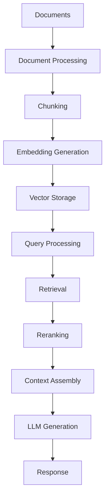

# RAG Pipeline Complete Reference

**Complete documentation for Retrieval-Augmented Generation (RAG) pipeline in NeuronDB.**

> **Version:** 1.0  
> **Last Updated:** 2025-01-01

## Table of Contents

- [Overview](#overview)
- [Document Processing](#document-processing)
- [Chunking Strategies](#chunking-strategies)
- [Embedding Generation](#embedding-generation)
- [Retrieval Methods](#retrieval-methods)
- [Reranking Strategies](#reranking-strategies)
- [LLM Integration](#llm-integration)
- [End-to-End Examples](#end-to-end-examples)

---

## Overview

NeuronDB provides a complete RAG pipeline for building question-answering systems and document retrieval applications.

### Pipeline Flow



---

## Document Processing

### Text Chunking

**Function:** `neurondb_chunk_text(text, integer, integer, text) → text[]`

**Parameters:**
- `text`: Text to chunk
- `chunk_size`: Chunk size in characters (default: 512)
- `overlap`: Overlap between chunks (default: 128)
- `separator`: Separator text (default: NULL)

**Returns:** Array of text chunks

**Example:**
```sql
SELECT neurondb_chunk_text(
    'Long document text...',
    512,   -- chunk_size
    128,   -- overlap
    NULL   -- separator
);
```

**Chunking Methods:**

1. **Fixed Size:** Fixed character count per chunk
2. **Sentence-Aware:** Chunks at sentence boundaries
3. **Paragraph-Aware:** Chunks at paragraph boundaries
4. **Semantic:** Chunks based on semantic similarity

---

### Document Ranking

**Function:** `neurondb_rank_documents(text, text[], text) → jsonb`

**Parameters:**
- `query`: Query text
- `documents`: Array of document texts
- `algorithm`: Ranking algorithm (default: 'bm25')
  - Options: `'bm25'`, `'cosine'`, `'edit_distance'`

**Returns:**
```json
{
  "rankings": [
    {"idx": 0, "score": 0.95, "document": "..."},
    {"idx": 1, "score": 0.87, "document": "..."}
  ]
}
```

**Example:**
```sql
SELECT neurondb_rank_documents(
    'machine learning',
    ARRAY['ML is...', 'AI is...', 'Deep learning...'],
    'bm25'
);
```

---

## Chunking Strategies

### Fixed Size Chunking

**Use Case:** Uniform chunk sizes for consistent retrieval

**Example:**
```sql
SELECT neurondb_chunk_text(
    document_text,
    512,  -- Fixed 512 characters
    128   -- 128 character overlap
);
```

### Sentence-Aware Chunking

**Use Case:** Preserve sentence boundaries

**Implementation:**
- Detects sentence boundaries
- Chunks at sentence ends
- Maintains semantic coherence

### Paragraph-Aware Chunking

**Use Case:** Preserve paragraph structure

**Implementation:**
- Detects paragraph boundaries
- Chunks at paragraph ends
- Preserves document structure

### Semantic Chunking

**Use Case:** Chunks based on semantic similarity

**Implementation:**
- Uses embeddings to detect semantic boundaries
- Groups similar content together
- Optimizes for retrieval quality

---

## Embedding Generation

### Text Embeddings

**Function:** `embed_text(text, text) → vector`

**Parameters:**
- `text`: Text to embed
- `model_name`: Model name (uses default if NULL)

**Example:**
```sql
-- Generate embedding
SELECT embed_text('Hello world', 'sentence-transformers/all-MiniLM-L6-v2');

-- Batch embedding
SELECT embed_text_batch(
    ARRAY['Document 1', 'Document 2', 'Document 3'],
    'sentence-transformers/all-MiniLM-L6-v2'
);
```

### Cached Embeddings

**Function:** `embed_cached(text, text) → vector`

**Parameters:**
- `text`: Text to embed
- `model_name`: Model name

**Features:**
- Uses cache if available
- Reduces API calls
- Faster for repeated queries

**Example:**
```sql
SELECT embed_cached('Hello world', 'all-MiniLM-L6-v2');
```

### Model Configuration

**Function:** `configure_embedding_model(text, text) → boolean`

**Parameters:**
- `model_name`: Model name
- `config_json`: JSON configuration

**Example:**
```sql
SELECT configure_embedding_model(
    'all-MiniLM-L6-v2',
    '{"batch_size": 32, "max_length": 512}'
);
```

---

## Retrieval Methods

### Vector Search

**Basic Vector Search:**
```sql
SELECT id, content, embedding <-> query_vector AS distance
FROM documents
ORDER BY embedding <-> query_vector
LIMIT 10;
```

### Hybrid Search

**Function:** `hybrid_search(text, vector, text, text, double precision, integer, text) → TABLE(id, score)`

**Parameters:**
- `table`: Table name
- `query_vec`: Query vector
- `query_text`: Query text
- `filters`: JSON filters (default: '{}')
- `vector_weight`: Weight for vector component (default: 0.7)
- `limit`: Maximum results (default: 10)
- `query_type`: Query type - 'plain', 'to', or 'phrase' (default: 'plain')

**Example:**
```sql
SELECT * FROM hybrid_search(
    'documents',
    '[0.1, 0.2, 0.3]'::vector,
    'machine learning',
    '{}',
    0.7,
    10,
    'plain'
);
```

### Semantic + Keyword Search

**Function:** `semantic_keyword_search(text, vector, text, integer) → TABLE(id, score)`

**Parameters:**
- `table`: Table name
- `semantic_query`: Semantic query vector
- `keyword_query`: Keyword query text
- `top_k`: Number of results (default: 10)

**Example:**
```sql
SELECT * FROM semantic_keyword_search(
    'documents',
    '[0.1, 0.2, 0.3]'::vector,
    'machine learning',
    10
);
```

### Multi-Vector Search

**Function:** `multi_vector_search(text, vector[], text, integer) → TABLE(id, score)`

**Parameters:**
- `table`: Table name
- `query_vectors`: Array of query vectors
- `agg_method`: Aggregation method - 'max', 'avg', 'sum' (default: 'max')
- `top_k`: Number of results (default: 10)

**Example:**
```sql
SELECT * FROM multi_vector_search(
    'documents',
    ARRAY['[0.1, 0.2]'::vector, '[0.3, 0.4]'::vector],
    'max',
    10
);
```

---

## Reranking Strategies

### Cross-Encoder Reranking

**Function:** `rerank_cross_encoder(text, text[], text, integer) → TABLE(idx, score)`

**Parameters:**
- `query`: Query text
- `candidates`: Array of candidate texts
- `model`: Model name (default: 'ms-marco-MiniLM-L-6-v2')
- `top_k`: Number of top results (default: 10)

**Example:**
```sql
SELECT * FROM rerank_cross_encoder(
    'What is machine learning?',
    ARRAY['ML is...', 'AI is...', 'Deep learning...'],
    'ms-marco-MiniLM-L-6-v2',
    10
);
```

**GPU Acceleration:**
- GPU-accelerated inference when available
- Falls back to ONNX Runtime or remote API

### LLM Reranking

**Function:** `rerank_llm(text, text[], text, integer) → TABLE(idx, score)`

**Parameters:**
- `query`: Query text
- `candidates`: Array of candidate texts
- `model`: Model name (default: 'gpt-3.5-turbo')
- `top_k`: Number of top results (default: 10)

**Example:**
```sql
SELECT * FROM rerank_llm(
    'What is machine learning?',
    ARRAY['ML is...', 'AI is...'],
    'gpt-3.5-turbo',
    10
);
```

### ColBERT Reranking

**Function:** `rerank_colbert(text, text[], text) → TABLE(idx, score)`

**Parameters:**
- `query`: Query text
- `docs`: Array of documents
- `model`: Model name (default: 'colbert-v2')

**Features:**
- Late interaction reranking
- Token-level matching
- High accuracy

**Example:**
```sql
SELECT * FROM rerank_colbert(
    'What is machine learning?',
    ARRAY['ML is...', 'AI is...'],
    'colbert-v2'
);
```

### Ensemble Reranking

**Function:** `rerank_ensemble(text, text[], text[], double precision[]) → TABLE(idx, score)`

**Parameters:**
- `query`: Query text
- `docs`: Array of documents
- `models`: Array of model names
- `weights`: Array of weights

**Example:**
```sql
SELECT * FROM rerank_ensemble(
    'What is machine learning?',
    ARRAY['ML is...', 'AI is...'],
    ARRAY['model1', 'model2'],
    ARRAY[0.6, 0.4]
);
```

---

## LLM Integration

### Text Generation

**Function:** `neurondb_llm_generate(text, text, jsonb) → text`

**Parameters:**
- `model`: Model name
- `prompt`: Prompt text
- `params`: JSONB parameters (temperature, max_tokens, etc.)

**Example:**
```sql
SELECT neurondb_llm_generate(
    'gpt-3.5-turbo',
    'What is machine learning?',
    '{"temperature": 0.7, "max_tokens": 100}'::jsonb
);
```

### Streaming Generation

**Function:** `neurondb_llm_generate_stream(text, text, jsonb) → SETOF text`

**Returns:** Text in chunks

**Example:**
```sql
SELECT * FROM neurondb_llm_generate_stream(
    'gpt-3.5-turbo',
    'What is machine learning?',
    '{}'::jsonb
);
```

### RAG Answer Generation

**Function:** `neurondb_generate_answer(text, text[], text, jsonb) → text`

**Parameters:**
- `query`: Query text
- `context`: Array of context texts
- `model`: Model name (optional)
- `params`: JSONB parameters

**Example:**
```sql
SELECT neurondb_generate_answer(
    'What is machine learning?',
    ARRAY['Context 1...', 'Context 2...'],
    'gpt-3.5-turbo',
    '{"temperature": 0.7}'::jsonb
);
```

---

## End-to-End Examples

### Complete RAG Pipeline

**Step 1: Ingest Documents**

```sql
-- Create table
CREATE TABLE documents (
    id SERIAL PRIMARY KEY,
    content TEXT,
    embedding vector(384)
);

-- Insert documents with embeddings
INSERT INTO documents (content, embedding)
SELECT 
    content,
    embed_text(content, 'sentence-transformers/all-MiniLM-L6-v2')
FROM raw_documents;
```

**Step 2: Create Index**

```sql
-- Create HNSW index
CREATE INDEX ON documents USING hnsw (embedding vector_cosine_ops);
```

**Step 3: Query with RAG**

```sql
-- Generate query embedding
WITH query_embedding AS (
    SELECT embed_text('What is machine learning?', 'sentence-transformers/all-MiniLM-L6-v2') AS vec
),
-- Retrieve relevant documents
retrieved AS (
    SELECT 
        id,
        content,
        embedding <=> (SELECT vec FROM query_embedding) AS distance
    FROM documents
    ORDER BY embedding <=> (SELECT vec FROM query_embedding)
    LIMIT 10
),
-- Rerank results
reranked AS (
    SELECT 
        idx,
        score
    FROM rerank_cross_encoder(
        'What is machine learning?',
        ARRAY(SELECT content FROM retrieved ORDER BY distance),
        'ms-marco-MiniLM-L-6-v2',
        5
    )
)
-- Generate answer
SELECT neurondb_generate_answer(
    'What is machine learning?',
    ARRAY(
        SELECT content 
        FROM retrieved 
        WHERE id IN (
            SELECT (SELECT content FROM retrieved ORDER BY distance LIMIT 1 OFFSET idx)
            FROM reranked
        )
    ),
    'gpt-3.5-turbo',
    '{"temperature": 0.7}'::jsonb
) AS answer;
```

### Simplified RAG Function

**Create Helper Function:**
```sql
CREATE OR REPLACE FUNCTION rag_query(
    query_text TEXT,
    top_k INTEGER DEFAULT 5
) RETURNS TEXT AS $$
DECLARE
    query_vec vector;
    contexts TEXT[];
    answer TEXT;
BEGIN
    -- Generate query embedding
    query_vec := embed_text(query_text, 'sentence-transformers/all-MiniLM-L6-v2');
    
    -- Retrieve contexts
    SELECT ARRAY_AGG(content ORDER BY embedding <=> query_vec)
    INTO contexts
    FROM (
        SELECT content, embedding
        FROM documents
        ORDER BY embedding <=> query_vec
        LIMIT top_k
    ) sub;
    
    -- Generate answer
    answer := neurondb_generate_answer(
        query_text,
        contexts,
        'gpt-3.5-turbo',
        '{"temperature": 0.7}'::jsonb
    );
    
    RETURN answer;
END;
$$ LANGUAGE plpgsql;
```

**Usage:**
```sql
SELECT rag_query('What is machine learning?', 5);
```

---

## Performance Optimization

### Batch Processing

Use batch operations for better performance:

```sql
-- Batch embedding generation
SELECT embed_text_batch(
    ARRAY['Doc 1', 'Doc 2', 'Doc 3'],
    'sentence-transformers/all-MiniLM-L6-v2'
);
```

### Caching

Enable caching for repeated queries:

```sql
-- Use cached embeddings
SELECT embed_cached('Hello world', 'all-MiniLM-L6-v2');
```

### Index Optimization

Create appropriate indexes:

```sql
-- HNSW for high-dimensional vectors
CREATE INDEX ON documents USING hnsw (embedding vector_cosine_ops);

-- Full-text search index
CREATE INDEX ON documents USING gin(to_tsvector('english', content));
```

---

## Related Documentation

- [SQL API Reference](../reference/sql-api-complete.md)
- [Hybrid Search](../reference/sql-api-complete.md#hybrid-search)
- [Reranking](../reference/sql-api-complete.md#reranking)
- [LLM Functions](../reference/sql-api-complete.md#llm-functions)

---

**Last Updated:** 2025-01-01  
**Documentation Version:** 1.0.0

