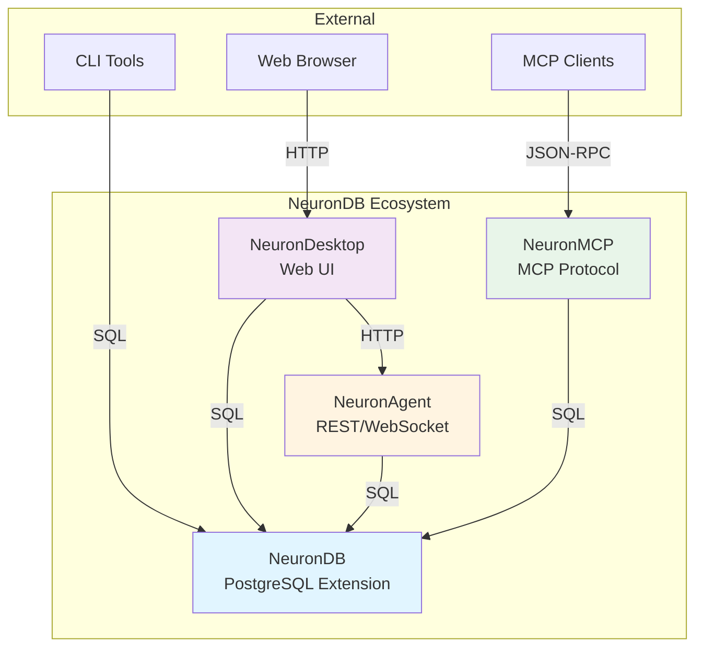

# 🌐 Ecosystem

<div align="center">

**How NeuronDB components integrate and work together**

[](integration.md)
[](../components/README.md)

</div>

---

## 🔗 Quick Links

| Document | Description |
|----------|-------------|
| [Integration Guide](integration.md) | Component integration patterns |
| [Docker Orchestration](../../dockers/README.md) | Docker deployment for all services |
| [Repository docker-compose.yml](../../docker-compose.yml) | Root orchestration file |

---

## 🏗️ Ecosystem Architecture

<details>
<summary><strong>📐 Component Integration Diagram</strong></summary>



</details>

---

## 🔄 Integration Patterns

<details>
<summary><strong>📡 Communication Patterns</strong></summary>

| Pattern | Components | Protocol | Use Case |
|---------|------------|----------|----------|
| **Direct SQL** | Any → NeuronDB | PostgreSQL | Direct database access |
| **REST API** | Client → NeuronAgent | HTTP | Agent management |
| **WebSocket** | Client → NeuronAgent | WebSocket | Streaming responses |
| **MCP Protocol** | MCP Client → NeuronMCP | JSON-RPC | Tool execution |
| **Web UI** | Browser → NeuronDesktop | HTTP | User interface |

</details>

---

## 🐳 Docker Orchestration

<details>
<summary><strong>🐋 Docker Compose Setup</strong></summary>

The root `docker-compose.yml` orchestrates all services:

```yaml
services:
  neurondb:      # PostgreSQL with NeuronDB extension
  neuronagent:   # REST/WebSocket API server
  neuronmcp:     # MCP protocol server
  neurondesk-api:      # Desktop API
  neurondesk-frontend: # Desktop UI
```

**See**: [Docker Guide](../../dockers/README.md)

</details>

---

## 📚 Related Documentation

- **[Components](../components/README.md)** - Individual component details
- **[Getting Started](../getting-started/README.md)** - Setup guides
- **[Deployment](../deployment/README.md)** - Production deployment

---

<div align="center">

[⬆ Back to Top](#-ecosystem) · [📚 Main Documentation](../../documentation.md)

</div>
