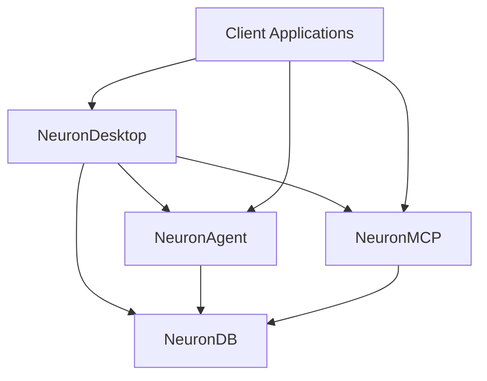
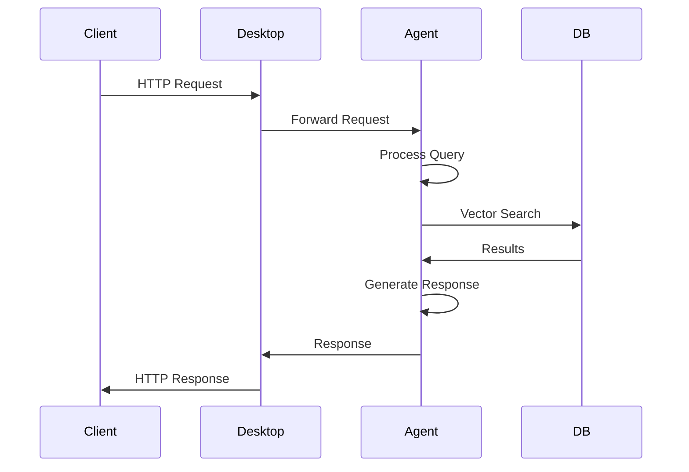
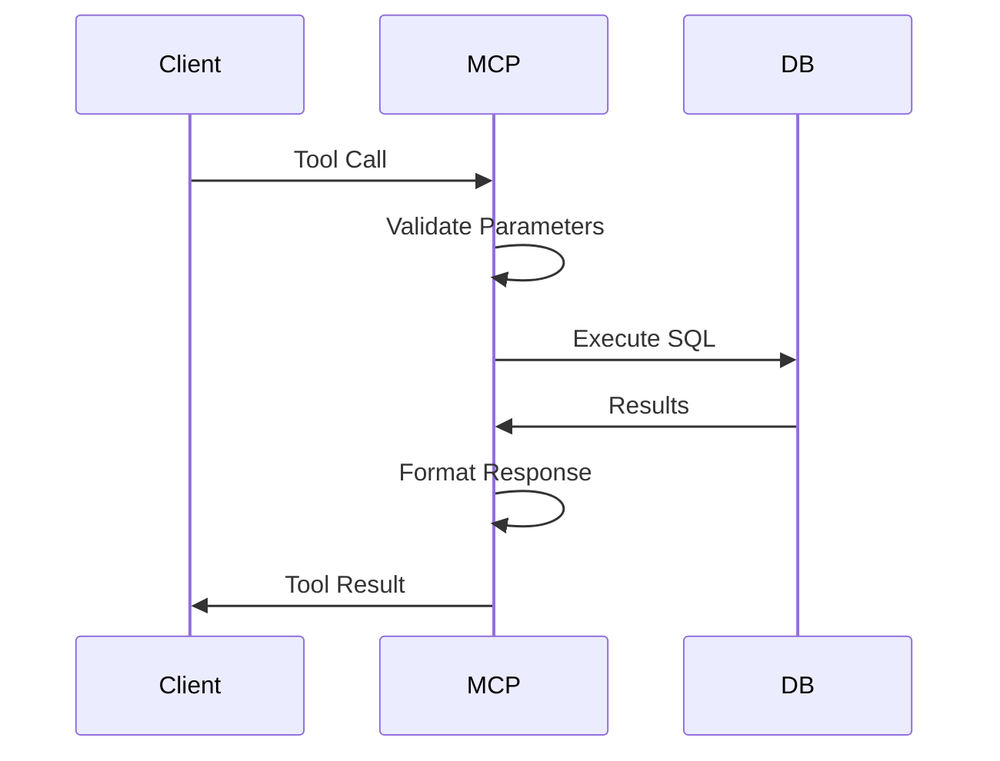
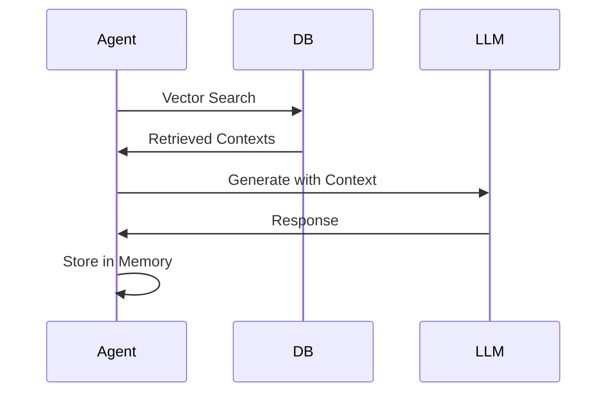

# NeuronDB Ecosystem Integration Complete Guide

**Complete guide for integrating NeuronDB, NeuronAgent, NeuronMCP, and NeuronDesktop.**

> **Version:** 1.0  
> **Last Updated:** 2025-01-01

## Table of Contents

- [Overview](#overview)
- [Component Communication](#component-communication)
- [Data Flow](#data-flow)
- [Authentication](#authentication)
- [Configuration Sharing](#configuration-sharing)
- [Deployment Coordination](#deployment-coordination)
- [Integration Examples](#integration-examples)

---

## Overview

The NeuronDB ecosystem consists of four main components:

1. **NeuronDB:** PostgreSQL extension for vector search and ML
2. **NeuronAgent:** AI agent runtime with REST/WebSocket API
3. **NeuronMCP:** MCP protocol server for tool access
4. **NeuronDesktop:** Web UI and API for ecosystem management

### Architecture



---

## Component Communication

### NeuronDesktop → NeuronAgent

**Communication:** HTTP REST API

**Endpoints:**
- `GET /api/v1/profiles/{profile_id}/agents`
- `POST /api/v1/profiles/{profile_id}/agents`
- `POST /api/v1/profiles/{profile_id}/agents/{agent_id}/messages`

**Configuration:**
```yaml
# NeuronDesktop config
agent_endpoint: "http://localhost:8080"
agent_api_key: "your-api-key"
```

---

### NeuronDesktop → NeuronMCP

**Communication:** MCP Protocol (stdin/stdout or WebSocket)

**Configuration:**
```yaml
# NeuronDesktop config
mcp_config:
  command: "neurondb-mcp"
  args: []
  env:
    NEURONDB_HOST: "localhost"
    NEURONDB_PORT: "5432"
```

---

### NeuronDesktop → NeuronDB

**Communication:** PostgreSQL connection

**Configuration:**
```yaml
# NeuronDesktop config
neurondb_dsn: "host=localhost port=5432 user=neurondb dbname=neurondb"
```

---

### NeuronAgent → NeuronDB

**Communication:** PostgreSQL connection

**Configuration:**
```yaml
# NeuronAgent config
database:
  host: "localhost"
  port: 5432
  user: "neurondb"
  password: "password"
  dbname: "neurondb"
```

**Usage:**
- Agent memory storage
- Vector search operations
- ML model access

---

### NeuronMCP → NeuronDB

**Communication:** PostgreSQL connection

**Configuration:**
```yaml
# NeuronMCP config
database:
  host: "localhost"
  port: 5432
  user: "neurondb"
  password: "password"
  dbname: "neurondb"
```

**Usage:**
- Tool execution
- Vector operations
- ML operations
- PostgreSQL administration

---

## Data Flow

### Agent Query Flow



### MCP Tool Execution Flow



### RAG Pipeline Flow



---

## Authentication

### Cross-Component Authentication

#### API Keys

**NeuronAgent:**
```yaml
# NeuronAgent config
auth:
  api_keys:
    - key: "your-api-key"
      permissions: ["read", "write"]
```

**NeuronDesktop:**
```yaml
# NeuronDesktop config
agent_api_key: "your-api-key"
```

#### JWT Tokens

**NeuronDesktop:**
- Issues JWT tokens for user authentication
- Validates tokens for API access
- Supports OIDC for enterprise SSO

**Configuration:**
```yaml
# NeuronDesktop config
auth:
  jwt:
    secret: "your-jwt-secret"
    expires_in: "24h"
  oidc:
    enabled: true
    issuer: "https://your-oidc-provider"
    client_id: "your-client-id"
```

---

## Configuration Sharing

### Shared Configuration

**Environment Variables:**
```bash
# Shared across components
export NEURONDB_HOST=localhost
export NEURONDB_PORT=5432
export NEURONDB_USER=neurondb
export NEURONDB_PASSWORD=password
export NEURONDB_DB=neurondb
```

**Docker Compose:**
```yaml
services:
  neurondb:
    environment:
      POSTGRES_USER: ${NEURONDB_USER}
      POSTGRES_PASSWORD: ${NEURONDB_PASSWORD}
      POSTGRES_DB: ${NEURONDB_DB}
  
  neuronagent:
    environment:
      NEURONDB_HOST: neurondb
      NEURONDB_PORT: 5432
      NEURONDB_USER: ${NEURONDB_USER}
      NEURONDB_PASSWORD: ${NEURONDB_PASSWORD}
      NEURONDB_DB: ${NEURONDB_DB}
  
  neuronmcp:
    environment:
      NEURONDB_HOST: neurondb
      NEURONDB_PORT: 5432
      NEURONDB_USER: ${NEURONDB_USER}
      NEURONDB_PASSWORD: ${NEURONDB_PASSWORD}
      NEURONDB_DB: ${NEURONDB_DB}
```

---

## Deployment Coordination

### Docker Compose Full Stack

**Full Stack Deployment:**
```yaml
services:
  neurondb:
    # ... NeuronDB configuration ...
  
  neuronagent:
    depends_on:
      - neurondb
    environment:
      NEURONDB_HOST: neurondb
      NEURONDB_PORT: 5432
  
  neuronmcp:
    depends_on:
      - neurondb
    environment:
      NEURONDB_HOST: neurondb
      NEURONDB_PORT: 5432
  
  neurondesktop:
    depends_on:
      - neurondb
      - neuronagent
      - neuronmcp
    environment:
      NEURONDB_DSN: "host=neurondb port=5432 user=neurondb dbname=neurondb"
      AGENT_ENDPOINT: "http://neuronagent:8080"
      MCP_ENDPOINT: "http://neuronmcp:8082"
```

**Start:**
```bash
docker compose --profile full up -d
```

---

### Service Discovery

**Health Checks:**
```yaml
services:
  neurondb:
    healthcheck:
      test: ["CMD-SHELL", "pg_isready -U neurondb"]
      interval: 10s
      timeout: 5s
      retries: 5
  
  neuronagent:
    healthcheck:
      test: ["CMD-SHELL", "curl -f http://localhost:8080/health"]
      interval: 10s
      timeout: 5s
      retries: 5
    depends_on:
      neurondb:
        condition: service_healthy
```

---

## Integration Examples

### Complete RAG Application

**Architecture:**
1. NeuronDesktop: Web UI
2. NeuronAgent: Agent runtime
3. NeuronDB: Vector storage and search
4. NeuronMCP: Tool access

**Setup:**

**Step 1: Deploy Services**
```bash
docker compose --profile full up -d
```

**Step 2: Configure Profile in NeuronDesktop**
```json
{
  "name": "Production",
  "neurondb_dsn": "host=neurondb port=5432 user=neurondb dbname=neurondb",
  "agent_endpoint": "http://neuronagent:8080",
  "agent_api_key": "your-api-key",
  "mcp_config": {
    "command": "neurondb-mcp",
    "args": [],
    "env": {
      "NEURONDB_HOST": "neurondb",
      "NEURONDB_PORT": "5432"
    }
  }
}
```

**Step 3: Create Agent**
```bash
curl -X POST http://localhost:8080/api/v1/agents \
  -H "Authorization: Bearer your-api-key" \
  -H "Content-Type: application/json" \
  -d '{
    "name": "rag-agent",
    "system_prompt": "You are a helpful assistant that answers questions using retrieved context.",
    "model_name": "gpt-4",
    "enabled_tools": ["vector_search", "hybrid_search", "rerank_cross_encoder"],
    "config": {
      "temperature": 0.7,
      "max_tokens": 1000
    }
  }'
```

**Step 4: Ingest Documents**
```sql
-- Create table
CREATE TABLE documents (
    id SERIAL PRIMARY KEY,
    content TEXT,
    embedding vector(384)
);

-- Insert documents
INSERT INTO documents (content, embedding)
SELECT 
    content,
    embed_text(content, 'sentence-transformers/all-MiniLM-L6-v2')
FROM raw_documents;

-- Create index
CREATE INDEX ON documents USING hnsw (embedding vector_cosine_ops);
```

**Step 5: Query via Agent**
```bash
curl -X POST http://localhost:8080/api/v1/sessions/{session_id}/messages \
  -H "Authorization: Bearer your-api-key" \
  -H "Content-Type: application/json" \
  -d '{
    "role": "user",
    "content": "What is machine learning?"
  }'
```

---

### MCP Integration

**Setup MCP Client:**

**Claude Desktop:**
```json
{
  "mcpServers": {
    "neurondb": {
      "command": "neurondb-mcp",
      "args": [],
      "env": {
        "NEURONDB_HOST": "localhost",
        "NEURONDB_PORT": "5432",
        "NEURONDB_USER": "neurondb",
        "NEURONDB_PASSWORD": "password",
        "NEURONDB_DB": "neurondb"
      }
    }
  }
}
```

**Use Tools:**
```javascript
// MCP tool call
{
  "name": "vector_search",
  "arguments": {
    "table": "documents",
    "vector_column": "embedding",
    "query_vector": [0.1, 0.2, 0.3],
    "limit": 10
  }
}
```

---

### Agent + MCP Integration

**Agent with MCP Tools:**

**Create Agent:**
```json
{
  "name": "mcp-agent",
  "system_prompt": "You have access to NeuronDB tools via MCP.",
  "model_name": "gpt-4",
  "enabled_tools": ["mcp_vector_search", "mcp_hybrid_search"]
}
```

**Agent uses MCP tools for:**
- Vector search operations
- ML model training
- Database administration
- Analytics operations

---

## Related Documentation

- [NeuronAgent API](../reference/neuronagent-api-complete.md)
- [NeuronMCP Tools](../reference/neuronmcp-tools-complete.md)
- [NeuronDesktop API](../reference/neurondesktop-api-complete.md)
- [Deployment Guide](../deployment/deployment-complete.md)

---

**Last Updated:** 2025-01-01  
**Documentation Version:** 1.0.0


