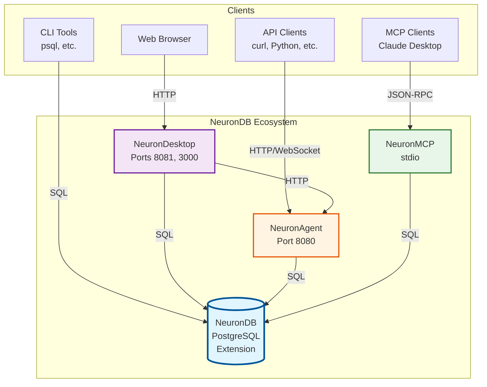
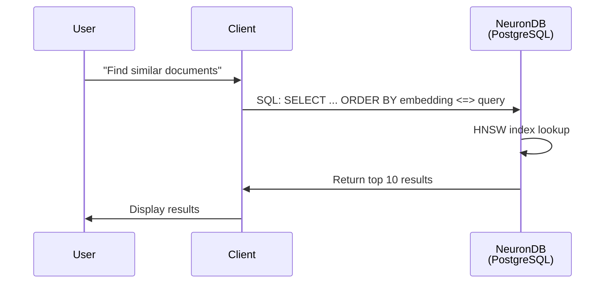
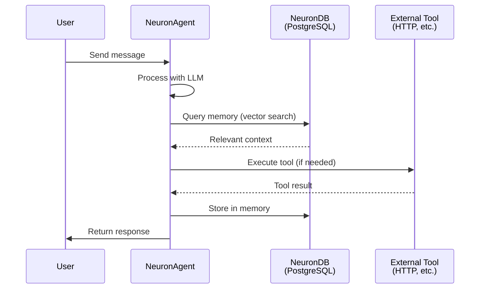
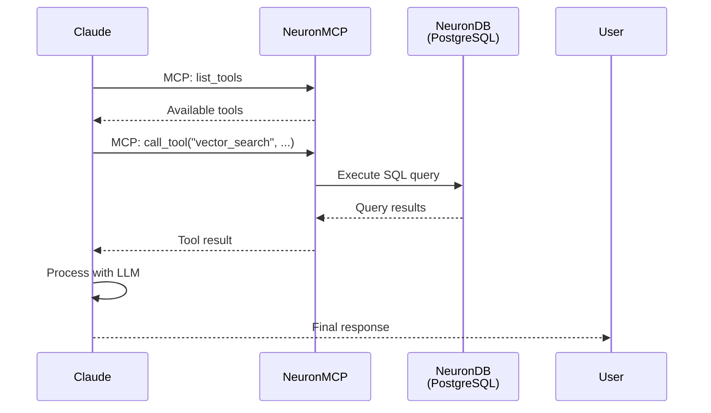
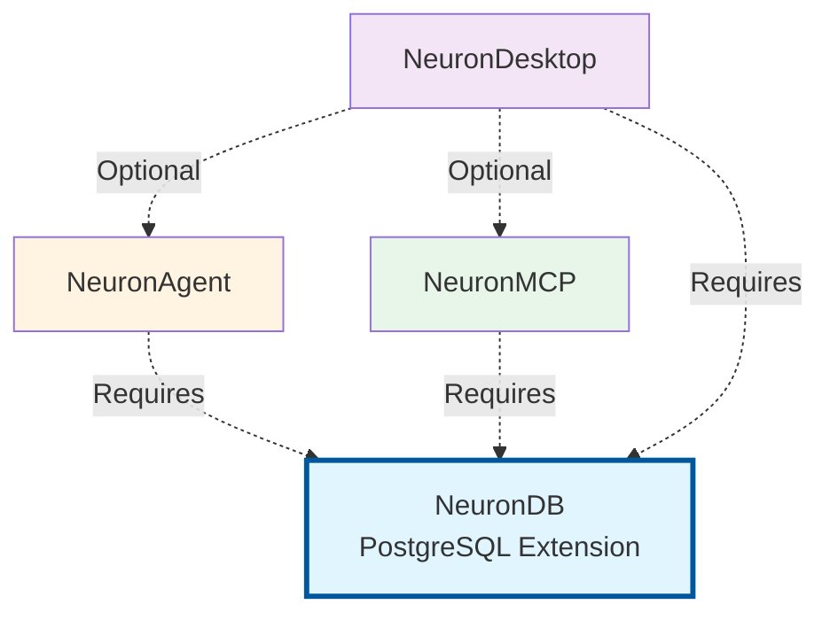

# 🏗️ Architecture Overview

<div align="center">

**Newcomer-friendly explanation of how NeuronDB components fit together**

[](.)
[](.)

</div>

---

> [!TIP]
> **New to NeuronDB?** This guide explains the big picture. For setup instructions, see the [Simple Start Guide](simple-start.md).

---

## 🎯 What is NeuronDB?

NeuronDB is a **PostgreSQL extension** that adds AI capabilities directly to your database:

- 🔍 **Vector search** - Find similar data using embeddings
- 🤖 **Machine learning** - Train and run ML models in SQL
- 🧠 **Embeddings** - Generate vector representations of text/images
- 🔗 **RAG pipelines** - Build retrieval-augmented generation systems
- 🤖 **Agent runtime** - Run AI agents with persistent memory

---

## 🧩 Components Overview

NeuronDB consists of **four main components** that work together:

| Component | What It Does | Required? |
|-----------|--------------|-----------|
| **🐘 NeuronDB** | PostgreSQL extension with vector/ML features | ✅ **Yes** (core) |
| **🤖 NeuronAgent** | REST/WebSocket API for agent workflows | ❌ Optional |
| **🔌 NeuronMCP** | MCP protocol server for LLM clients | ❌ Optional |
| **🖥️ NeuronDesktop** | Web UI for managing and querying | ❌ Optional |

---

## 🏛️ Component Details

### 🐘 NeuronDB (PostgreSQL Extension)

**Location:** `NeuronDB/`

**What it is:**
- A PostgreSQL extension (like `pg_stat_statements` or `pg_trgm`)
- Adds new data types, functions, and operators to PostgreSQL
- Runs inside your PostgreSQL process

**What it provides:**
- ✅ Vector data types (`vector`, `halfvec`, `sparsevec`, etc.)
- ✅ Vector distance operators (`<=>`, `<->`, `<#>`)
- ✅ Index types (HNSW, IVF) for fast vector search
- ✅ 520+ SQL functions for ML, embeddings, RAG
- ✅ GPU acceleration (CUDA, ROCm, Metal)
- ✅ Background workers for async processing

**How to use it:**
```sql
-- Just SQL, no external services needed
CREATE EXTENSION neurondb;
CREATE TABLE docs (id SERIAL, embedding vector(384));
CREATE INDEX ON docs USING hnsw (embedding vector_cosine_ops);
SELECT * FROM docs ORDER BY embedding <=> query_vector LIMIT 10;
```

> [!NOTE]
> **NeuronDB is the foundation** - All other components use it for data storage and vector operations.

---

### 🤖 NeuronAgent (Agent Runtime)

**Location:** `NeuronAgent/`

**What it is:**
- A REST/WebSocket API server (written in Go)
- Provides agent runtime capabilities
- Stores agent state in PostgreSQL (via NeuronDB)

**What it provides:**
- ✅ Agent creation and management
- ✅ Session handling for conversations
- ✅ Tool execution (SQL, HTTP, Code, Shell, etc.)
- ✅ Long-term memory with vector search
- ✅ Multi-agent collaboration
- ✅ Workflow engine with DAG support
- ✅ Human-in-the-loop (HITL) capabilities
- ✅ Budget and cost management

**How to use it:**
```bash
# Start the service
docker compose up -d neuronagent

# Create an agent via REST API
curl -X POST http://localhost:8080/api/v1/agents \
  -H "Authorization: Bearer YOUR_API_KEY" \
  -H "Content-Type: application/json" \
  -d '{
    "name": "my-agent",
    "system_prompt": "You are a helpful assistant",
    "model_name": "gpt-4"
  }'
```

> [!NOTE]
> **NeuronAgent uses NeuronDB** - It stores agent data, memory, and state in PostgreSQL using the NeuronDB extension.

---

### 🔌 NeuronMCP (MCP Protocol Server)

**Location:** `NeuronMCP/`

**What it is:**
- A Model Context Protocol (MCP) server
- Exposes NeuronDB capabilities as MCP tools
- Connects to MCP-compatible clients (Claude Desktop, etc.)

**What it provides:**
- ✅ 100+ MCP tools (vector ops, ML, RAG, PostgreSQL admin)
- ✅ MCP protocol support (prompts, sampling, resources)
- ✅ Middleware system (validation, logging, timeout, auth)
- ✅ Enterprise features (metrics, webhooks, circuit breaker)
- ✅ Batch operations and progress tracking

**How to use it:**
```json
// Configure in Claude Desktop (config.json)
{
  "mcpServers": {
    "neurondb": {
      "command": "docker",
      "args": ["exec", "-i", "neurondb-mcp", "/app/neurondb-mcp"]
    }
  }
}
```

> [!NOTE]
> **NeuronMCP uses NeuronDB** - All tools execute SQL queries against PostgreSQL with the NeuronDB extension.

---

### 🖥️ NeuronDesktop (Web UI)

**Location:** `NeuronDesktop/`

**What it is:**
- A web-based user interface
- Provides visual management and querying
- Built with React (frontend) and Go (backend API)

**What it provides:**
- ✅ SQL console for direct queries
- ✅ Vector search interface
- ✅ Agent management UI
- ✅ Database management
- ✅ Model management
- ✅ Real-time monitoring

**How to use it:**
```bash
# Start the service
docker compose up -d

# Access the web UI
open http://localhost:3000
```

> [!NOTE]
> **NeuronDesktop uses all components** - It connects to NeuronDB for data, NeuronAgent for agents, and NeuronMCP for tools.

---

## 🔄 How Components Communicate

<details>
<summary><strong>📡 Communication Diagram</strong></summary>



</details>

### Communication Patterns

| From | To | Protocol | Purpose | Example |
|------|-----|----------|---------|---------|
| **Client** | **NeuronDB** | PostgreSQL | Direct database access | `psql -c "SELECT ..."` |
| **Client** | **NeuronAgent** | HTTP/WebSocket | Agent management | `curl http://localhost:8080/api/v1/agents` |
| **Client** | **NeuronMCP** | JSON-RPC (stdio) | Tool execution | MCP client calls |
| **Client** | **NeuronDesktop** | HTTP | Web UI access | Browser → `http://localhost:3000` |
| **NeuronDesktop** | **NeuronAgent** | HTTP | Agent operations | UI → API → Agent |
| **NeuronAgent** | **NeuronDB** | SQL | Data storage | Agent stores memory in DB |
| **NeuronMCP** | **NeuronDB** | SQL | Tool execution | MCP tool runs SQL query |

---

## 🎯 Typical Usage Patterns

### Pattern A: "Just the Database" 🐘

**Use case:** You only need vector search in PostgreSQL

**Components:** NeuronDB only

**Setup:**
```bash
docker compose up -d neurondb
```

**What you can do:**
- ✅ Store embeddings
- ✅ Create vector indexes
- ✅ Run similarity searches
- ✅ Use ML algorithms
- ✅ Generate embeddings

**Example:**
```sql
CREATE TABLE documents (
  id SERIAL PRIMARY KEY,
  content TEXT,
  embedding vector(384)
);

CREATE INDEX ON documents USING hnsw (embedding vector_cosine_ops);

SELECT content, embedding <=> query_vector AS distance
FROM documents
ORDER BY embedding <=> query_vector
LIMIT 10;
```

---

### Pattern B: "Database + Agent" 🐘🤖

**Use case:** You want to run AI agents with persistent memory

**Components:** NeuronDB + NeuronAgent

**Setup:**
```bash
docker compose up -d neurondb neuronagent
```

**What you can do:**
- ✅ Everything from Pattern A
- ✅ Create and manage agents
- ✅ Run agent workflows
- ✅ Use tools (SQL, HTTP, Code, etc.)
- ✅ Maintain conversation history
- ✅ Long-term memory with vector search

**Example:**
```python
from neurondb_client import NeuronAgentClient

client = NeuronAgentClient()
agent = client.create_agent(
    name="data-analyst",
    system_prompt="You are a data analyst",
    enabled_tools=['sql']
)
session = client.create_session(agent_id=agent['id'])
response = client.send_message(
    session_id=session['id'],
    content="Find the top 10 customers by revenue"
)
```

---

### Pattern C: "Database + MCP" 🐘🔌

**Use case:** You want to use NeuronDB with Claude Desktop or other MCP clients

**Components:** NeuronDB + NeuronMCP

**Setup:**
```bash
docker compose up -d neurondb neuronmcp
```

**What you can do:**
- ✅ Everything from Pattern A
- ✅ Access NeuronDB via MCP tools
- ✅ Use with Claude Desktop
- ✅ Execute vector operations via MCP
- ✅ Run ML pipelines via MCP

**Example:**
```
User: "Find documents similar to 'machine learning'"
Claude → MCP → NeuronMCP → SQL → NeuronDB → Results
```

---

### Pattern D: "Full Stack" 🐘🤖🔌🖥️

**Use case:** You want everything - database, agents, MCP, and web UI

**Components:** All four components

**Setup:**
```bash
docker compose up -d
```

**What you can do:**
- ✅ Everything from Patterns A, B, and C
- ✅ Web-based management interface
- ✅ Visual query builder
- ✅ Agent management UI
- ✅ Real-time monitoring

**Example:**
1. Open `http://localhost:3000` in browser
2. Use SQL console to query data
3. Create agents via UI
4. Monitor system health

---

## 🗄️ Data Flow Examples

<details>
<summary><strong>📊 Example 1: Vector Search Flow</strong></summary>



**Steps:**
1. User sends query text
2. Client generates embedding (or uses existing)
3. Client sends SQL query to NeuronDB
4. NeuronDB uses HNSW index to find similar vectors
5. Results returned to client
6. Client displays results to user

</details>

<details>
<summary><strong>🤖 Example 2: Agent Workflow Flow</strong></summary>



**Steps:**
1. User sends message to agent
2. Agent queries memory (vector search in NeuronDB)
3. Agent processes with LLM + context
4. Agent executes tools if needed
5. Agent stores interaction in memory
6. Agent returns response to user

</details>

<details>
<summary><strong>🔌 Example 3: MCP Tool Execution Flow</strong></summary>



**Steps:**
1. Claude requests available tools
2. NeuronMCP returns tool list
3. Claude calls a tool (e.g., `vector_search`)
4. NeuronMCP executes SQL against NeuronDB
5. Results returned to Claude
6. Claude processes and responds to user

</details>

---

## 🔗 Component Dependencies

<details>
<summary><strong>📦 Dependency Graph</strong></summary>



**Key points:**
- ✅ **NeuronDB is required** - All other components depend on it
- ✅ **Components are independent** - You can run any combination
- ✅ **No circular dependencies** - Clean architecture

</details>

---

## 📊 Component Comparison

| Feature | NeuronDB | NeuronAgent | NeuronMCP | NeuronDesktop |
|---------|----------|-------------|-----------|---------------|
| **Type** | Extension | Service | Service | Web App |
| **Language** | C | Go | Go | Go + TypeScript |
| **Port** | 5433 | 8080 | stdio | 8081, 3000 |
| **Protocol** | PostgreSQL | HTTP/WebSocket | JSON-RPC | HTTP |
| **Storage** | PostgreSQL | PostgreSQL | PostgreSQL | PostgreSQL |
| **Required** | ✅ Yes | ❌ No | ❌ No | ❌ No |

---

## 🎓 Key Concepts

<details>
<summary><strong>📚 Understanding the Architecture</strong></summary>

### Why PostgreSQL Extension?

**NeuronDB is a PostgreSQL extension** because:
- ✅ **Native integration** - No external services needed for basic operations
- ✅ **ACID guarantees** - Vector data benefits from PostgreSQL's transaction model
- ✅ **SQL interface** - Use familiar SQL syntax for vector operations
- ✅ **Performance** - Runs in the same process as PostgreSQL

### Why Separate Services?

**NeuronAgent, NeuronMCP, and NeuronDesktop are separate services** because:
- ✅ **Different protocols** - Each serves different client types
- ✅ **Independent scaling** - Scale services independently
- ✅ **Optional components** - Use only what you need
- ✅ **Language flexibility** - Each can use the best language for its purpose

### How Do They Share Data?

**All components use the same PostgreSQL database:**
- NeuronDB provides the extension (data types, functions)
- NeuronAgent stores agent data in PostgreSQL tables
- NeuronMCP executes SQL queries against PostgreSQL
- NeuronDesktop queries PostgreSQL via SQL

**They all speak SQL!**

</details>

---

## 🔗 Where to Look Next

| Topic | Documentation | Description |
|-------|---------------|-------------|
| **Setup** | [Simple Start Guide](simple-start.md) | Get everything running |
| **Troubleshooting** | [Troubleshooting Guide](troubleshooting.md) | Common issues and fixes |
| **Components** | [Component Documentation](../components/README.md) | Detailed component info |
| **Integration** | [Ecosystem Integration](../ecosystem/integration.md) | How components work together |
| **Deployment** | [Deployment Guide](../deployment/README.md) | Production deployment |

---

<div align="center">

[⬆ Back to Top](#️-architecture-overview) · [📚 Main Documentation](../../documentation.md) · [🚀 Simple Start](simple-start.md)

</div>
