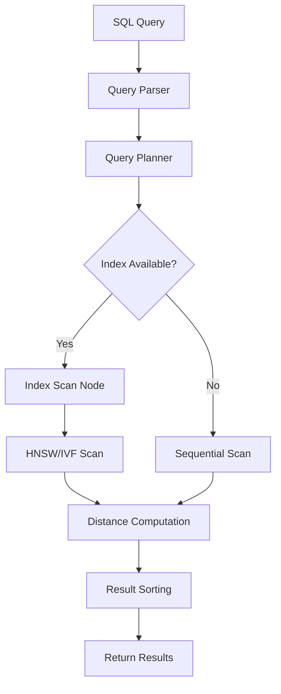
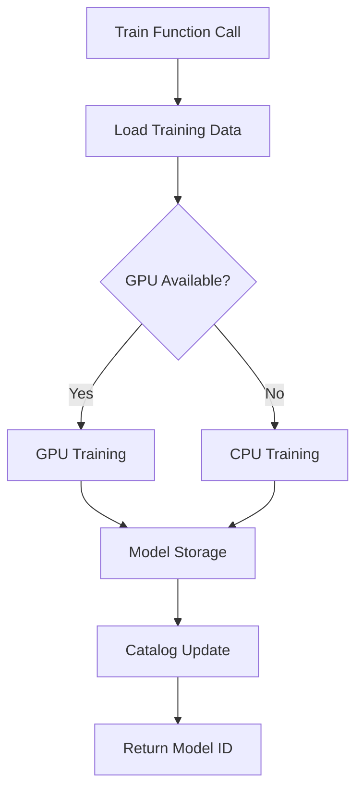
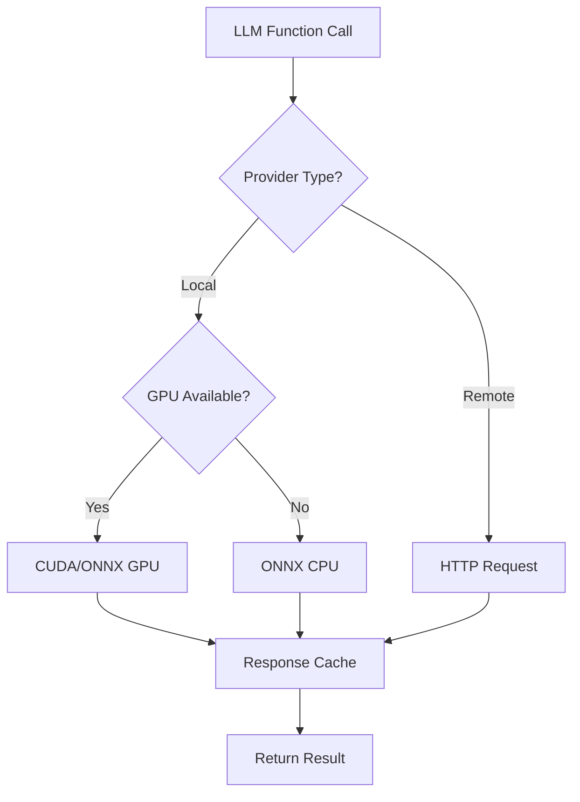
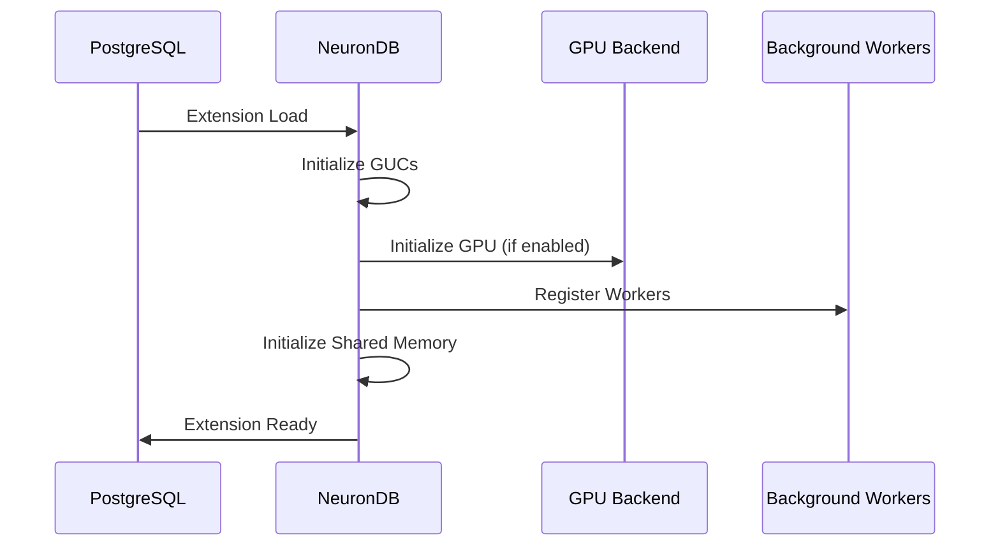
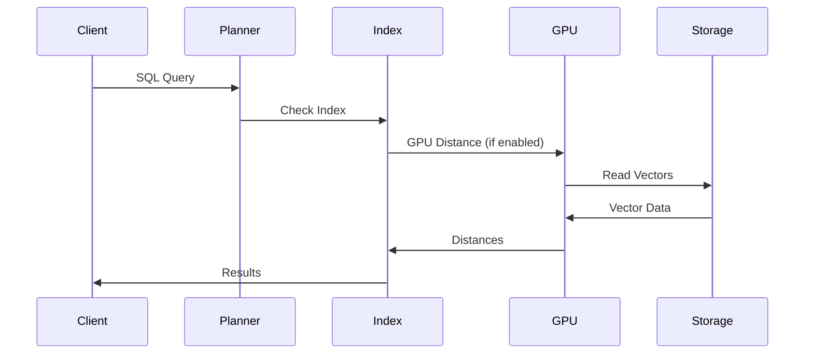

# NeuronDB Internal Architecture

**Complete internal architecture documentation for the NeuronDB PostgreSQL extension.**

> **Version:** 1.0  
> **PostgreSQL Compatibility:** 16, 17, 18  
> **Last Updated:** 2025-01-01

## Table of Contents

- [Source Code Organization](#source-code-organization)
- [Module Breakdown](#module-breakdown)
- [Data Flow](#data-flow)
- [Memory Management](#memory-management)
- [Threading Model](#threading-model)
- [Index Structures](#index-structures)
- [Component Interactions](#component-interactions)

---

## Source Code Organization

NeuronDB source code is organized into logical modules under `NeuronDB/src/`:

```
src/
├── core/           # Vector types and operations (5 files)
├── ml/             # 19 ML algorithm implementations (61 files)
├── gpu/            # GPU acceleration (CUDA, ROCm, Metal)
│   ├── common/     # Common GPU utilities (14 files)
│   ├── cuda/       # CUDA implementation (29 files)
│   ├── rocm/       # ROCm implementation (27 files)
│   └── metal/      # Metal implementation (6 files)
├── worker/         # Background workers (5 files)
├── index/          # HNSW & IVF access methods (8 files)
├── scan/           # Custom scan nodes (4 files)
├── llm/            # LLM integration (7 files)
├── search/         # Hybrid/temporal search (4 files)
├── metrics/        # Prometheus & stats (2 files)
├── storage/        # Buffer & WAL (3 files)
├── planner/        # Query optimization (1 file)
├── tenant/         # Multi-tenancy (1 file)
├── types/          # Quantization & aggregates (3 files)
├── util/           # Config, security, hooks (13 files)
├── vector/         # Vector operations (17 files)
└── onnx/           # ONNX Runtime integration (5 files)
```

---

## Module Breakdown

### Core Module (`core/`)

**Purpose:** Fundamental vector types and operations

**Files:**
- `neurondb.c`: Extension initialization and core functions
- `types_core.c`: Core type definitions
- `distance.c`: Distance metric implementations
- `operators.c`: Vector operators (+, -, *, /)
- `vector_ops.c`: Vector operations

**Key Functions:**
- Vector creation and manipulation
- Type I/O functions
- Basic arithmetic operations
- Distance computations

---

### ML Module (`ml/`)

**Purpose:** Machine learning algorithm implementations

**Algorithms (19 total):**

#### Clustering
- `ml_kmeans.c`: K-Means clustering
- `ml_minibatch_kmeans.c`: Mini-batch K-Means
- `ml_dbscan.c`: DBSCAN clustering
- `ml_gmm.c`: Gaussian Mixture Model / EM
- `ml_hierarchical.c`: Hierarchical Clustering

#### Classification
- `ml_random_forest.c`: Random Forest
- `ml_decision_tree.c`: Decision Trees (CART)
- `ml_logistic_regression.c`: Logistic Regression
- `ml_svm.c`: Support Vector Machines
- `ml_naive_bayes.c`: Naive Bayes
- `ml_gradient_boosting.c`: Gradient Boosting

#### Regression
- `ml_linear_regression.c`: Linear Regression (OLS)
- `ml_ridge_regression.c`: Ridge Regression
- `ml_lasso_regression.c`: Lasso Regression

#### Dimensionality Reduction
- `ml_pca.c`: Principal Component Analysis
- `ml_pca_whitening.c`: PCA Whitening

#### Quantization
- `ml_product_quantization.c`: Product Quantization (PQ)
- `ml_opq.c`: Optimized Product Quantization (OPQ)

#### Other
- `ml_outlier_detection.c`: Outlier detection (Z-score, Modified Z-score)
- `ml_timeseries.c`: Time series (ARIMA)
- `ml_recommender.c`: Recommendation systems

**Key Files:**
- `ml_unified_api.c`: Unified SQL API for ML operations
- `ml_projects.c`: ML project management
- `ml_inference.c`: Model inference
- `ml_gpu_registry.c`: GPU algorithm registry
- `ml_catalog.c`: Model catalog management

---

### GPU Module (`gpu/`)

**Purpose:** GPU acceleration for vector and ML operations

#### Common (`gpu/common/`)
- GPU backend interface
- Memory management
- Error handling
- Platform abstraction

#### CUDA (`gpu/cuda/`)
- CUDA kernel implementations
- CUDA memory management
- CUDA stream management
- Distance kernels (L2, cosine, inner product)
- ML kernels (Random Forest, etc.)

#### ROCm (`gpu/rocm/`)
- HIP kernel implementations
- ROCm memory management
- AMD GPU support

#### Metal (`gpu/metal/`)
- Metal shader implementations
- Metal memory management
- Apple Silicon GPU support

**Key Features:**
- Automatic GPU/CPU fallback
- Memory pool management
- Multi-stream execution
- Kernel caching

---

### Index Module (`index/`)

**Purpose:** Vector index access methods

**Files:**
- `hnsw_am.c`: HNSW index access method
- `ivf_am.c`: IVF index access method
- `index_consistent.c`: Index consistency checking
- `index_cache.c`: Index caching
- `index_hnsw_tenant.c`: Tenant-aware HNSW
- `index_hybrid.c`: Hybrid fused index (ANN + FTS)
- `index_temporal.c`: Temporal vector index
- `index_rerank.c`: Rerank-ready index
- `index_tuning.c`: Index auto-tuning
- `index_validator.c`: Index validation
- `sparse_index.c`: Sparse vector index
- `opclass.c`: Operator class definitions

**Index Types:**
1. **HNSW:** Hierarchical Navigable Small World
2. **IVF:** Inverted File Index
3. **Hybrid:** Fused ANN + Full-text search
4. **Temporal:** Time-decay aware indexing
5. **Sparse:** Sparse vector indexing

---

### Scan Module (`scan/`)

**Purpose:** Custom scan nodes for vector operations

**Files:**
- `hnsw_scan.c`: HNSW index scan
- `custom_hybrid_scan.c`: Hybrid search scan
- `scan_quota.c`: Quota enforcement during scans
- `scan_rls.c`: Row-level security for vectors

**Features:**
- Custom scan nodes for vector queries
- Quota enforcement
- RLS integration
- Parallel scan support

---

### LLM Module (`llm/`)

**Purpose:** Large Language Model integration

**Files:**
- `llm_runtime.c`: LLM runtime management
- `llm_router.c`: Provider routing
- `llm_cache.c`: Response caching
- `llm_jobs.c`: Asynchronous job queue
- `hf_http.c`: Hugging Face HTTP client
- `openai_http.c`: OpenAI HTTP client
- `llm_image_utils.c`: Image processing for vision models

**Features:**
- Multiple provider support (Hugging Face, OpenAI)
- Response caching
- Rate limiting
- Batch operations
- GPU acceleration support

---

### Search Module (`search/`)

**Purpose:** Hybrid and advanced search algorithms

**Files:**
- `hybrid_search.c`: Hybrid vector + text search
- `hybrid_dense_sparse.c`: Dense + sparse vector search
- `sparse_search.c`: Sparse vector search
- `temporal_integration.c`: Temporal search with decay

**Features:**
- Hybrid search (vector + full-text)
- Multi-vector search
- Temporal search with time decay
- Faceted search
- Diverse search (MMR)

---

### Storage Module (`storage/`)

**Purpose:** Buffer and WAL management

**Files:**
- `buffer.c`: Vector buffer management
- `ann_buffer.c`: ANN-specific buffers
- `vector_wal.c`: Write-ahead logging for vectors

**Features:**
- Efficient vector storage
- WAL for crash recovery
- Buffer pooling

---

### Planner Module (`planner/`)

**Purpose:** Query optimization

**Files:**
- `planner.c`: Query planner extensions

**Features:**
- Cost estimation for vector operations
- Index selection
- Join optimization

---

### Tenant Module (`tenant/`)

**Purpose:** Multi-tenancy support

**Files:**
- `multi_tenant.c`: Multi-tenant isolation

**Features:**
- Tenant isolation
- Per-tenant quotas
- Per-tenant configuration

---

### Types Module (`types/`)

**Purpose:** Type system extensions

**Files:**
- `quantization.c`: Quantization type functions
- `sparse_vector_types.c`: Sparse vector types
- `aggregates.c`: Vector aggregate functions

**Features:**
- Quantization support
- Sparse vector types
- Vector aggregates (avg, sum)

---

### Util Module (`util/`)

**Purpose:** Utility functions and infrastructure

**Files:**
- `config.c`: Configuration management
- `neurondb_guc.c`: GUC variable definitions
- `neurondb_json.c`: JSON utilities
- `neurondb_sql.c`: SQL utilities
- `neurondb_spi.c`: SPI (Server Programming Interface) utilities
- `neurondb_spi_safe.c`: Safe SPI wrappers
- `neurondb_simd_impl.c`: SIMD optimizations
- `neurondb_safe_memory.c`: Memory safety utilities
- `security.c`: Security functions
- `usability.c`: Usability helpers
- `data_management.c`: Data management utilities
- `distributed.c`: Distributed operations
- `gtree.c`: Generalized tree structures
- `hooks.c`: PostgreSQL hooks

---

### Vector Module (`vector/`)

**Purpose:** Advanced vector operations

**Files:**
- `vector_types.c`: Vector type definitions
- `vector_ops.c`: Basic vector operations
- `vector_distance.c`: Distance computations
- `vector_distance_simd.c`: SIMD-optimized distances
- `vector_advanced.c`: Advanced operations
- `vector_batch.c`: Batch operations
- `vector_quantization.c`: Quantization operations
- `vector_sparse.c`: Sparse vector operations
- `vector_graph_ops.c`: Graph operations
- `vector_capsule.c`: Vector capsule support
- `vector_cast.c`: Type casting
- `vector_wal.c`: Vector WAL

---

### Worker Module (`worker/`)

**Purpose:** Background workers

**Files:**
- `worker_init.c`: Worker initialization
- `worker_queue.c`: Queue executor (neuranq)
- `worker_tuner.c`: Auto-tuner (neuranmon)
- `worker_defrag.c`: Index defragmentation (neurandefrag)
- `worker_llm.c`: LLM background jobs (neuranllm)

**Workers:**
1. **neuranq:** Queue executor for async jobs
2. **neuranmon:** Auto-tuner for index parameters
3. **neurandefrag:** Index maintenance and defragmentation
4. **neuranllm:** LLM background job processing

---

### ONNX Module (`onnx/`)

**Purpose:** ONNX Runtime integration

**Files:**
- `neurondb_onnx.c`: ONNX Runtime C API wrapper
- `neurondb_hf.c`: Hugging Face model integration
- `neurondb_tokenizer.c`: Tokenizer support
- `hf_onex.py`: Hugging Face to ONNX export script
- `simple_hf_export.py`: Simple export script

**Features:**
- ONNX model loading and caching
- GPU execution provider support
- Model session management
- Tokenizer integration

---

### Metrics Module (`metrics/`)

**Purpose:** Monitoring and statistics

**Files:**
- `pg_stat_neurondb.c`: PostgreSQL statistics views
- `prometheus.c`: Prometheus metrics export

**Features:**
- Query statistics
- Index statistics
- GPU utilization
- LLM usage statistics

---

## Data Flow

### Vector Query Flow



### ML Training Flow



### LLM Request Flow



---

## Memory Management

### Memory Contexts

NeuronDB uses PostgreSQL's memory context system:

1. **TopMemoryContext:** Long-lived allocations
2. **CurrentMemoryContext:** Function-local allocations
3. **SPI Memory Context:** SPI operation allocations

### Memory Safety

- All allocations use PostgreSQL memory contexts
- Automatic cleanup on context deletion
- Safe memory wrappers in `neurondb_safe_memory.c`
- Memory leak detection in development

### GPU Memory

- Separate GPU memory pools
- Configurable pool size via `neurondb.gpu_memory_pool_mb`
- Automatic cleanup on error
- Memory pool reuse for performance

---

## Threading Model

### PostgreSQL Backend Processes

- Each connection runs in separate backend process
- No shared state between connections (except shared memory)
- Thread-safe operations use locks

### Background Workers

- Separate processes for background workers
- Shared memory for coordination
- Lock-based synchronization

### GPU Operations

- CUDA streams for parallelism
- Thread-safe GPU memory management
- Synchronous and asynchronous operations

---

## Index Structures

### HNSW Index

**Structure:**
- Multi-layer graph
- Bottom layer: All vectors
- Upper layers: Subset of vectors
- Hierarchical navigation

**Files:**
- `index/hnsw_am.c`: Access method implementation
- `index/index_hnsw_tenant.c`: Tenant-aware version

### IVF Index

**Structure:**
- Inverted file structure
- Clusters (lists) of vectors
- Centroid-based organization

**Files:**
- `index/ivf_am.c`: Access method implementation

### Hybrid Index

**Structure:**
- Combined HNSW + GIN full-text
- Single access method
- Unified scan node

**Files:**
- `index/index_hybrid.c`: Hybrid index implementation
- `scan/custom_hybrid_scan.c`: Hybrid scan node

---

## Component Interactions

### Extension Initialization



### Query Execution



---

## Related Documentation

- [SQL API Reference](../reference/sql-api-complete.md)
- [Data Types Reference](../reference/data-types.md)
- [Configuration Reference](../reference/configuration-complete.md)
- [Index Methods](index-methods.md)
- [GPU Acceleration](../advanced/gpu-acceleration-complete.md)

---

**Last Updated:** 2025-01-01  
**Documentation Version:** 1.0.0

